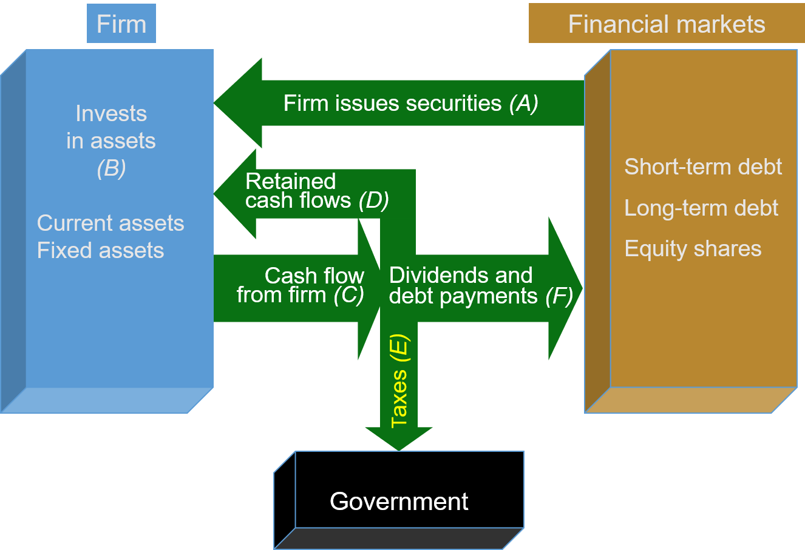

```{css, echo = FALSE}
.remark-slide-content {
  font-size: 18px;
  padding: 20px 80px 20px 80px;
}
.remark-code, .remark-inline-code {
  background: #f0f0f0;
}
.remark-code {
  font-size: 20px;
}
.huge .remark-code { /*Change made here*/
  font-size: 200% !important;
}
.tiny .remark-code { /*Change made here*/
  font-size: 75% !important;
}
```

# What is Finance?

.large[
- Finance is about the allocation of funds from a source to a project.

- The financial system's role is to transfer/utilize these funds in the most efficient way possible.

- Finance is largely about decision making from a quantitative lens.

  - From two persepectives: investors and firm managers.
]

---
# The Finance Roadmap

```{r, echo = F, out.width = "90%", fig.align="center"}

```
---

# Decision making in a Finance world

.large[
- The most important job of a financial manager is to make a firm's investment decisions.

- These decisions require the evaluation of costs and benefits.

- Decisions are made for an optimal path.

  - Managers must justify to shareholders that these investments are good uses of their money.
  
- Other deicisons that must be made by managers are financing decisions and cash management.
]
---

# Once decided to invest, <br> the only thing left is...


---

# Financing Decisions

.large[
- Once the investment decision is made, we have to decide how to pay for it:

  - Large investments may require the corporation to raise additional cash.
  
  - Do we raise money by issuing shares?
  
  - Or borrow money by issuing debt?
  
- These decisions determine the capital structure of the project and the firm.]
---

# Cash Management

.large[
- The firm needs to have enough cash on hand to meet its daily obligations.

- A firm typically burns through a significant amount of cash developing a new product before its sales can generate income.

- The decision here is to prevent firm's operation being hindered due to a lack of cash.
]

---

# Breakout Activity


---

# Breakout Activity

.large[
- Take some time to consider the the following questions and return with discussions:

1. If you have a large capital investment where retained earnings or cash on hand cannot cover the cost and you need to raise the money externally, how would you raise this money? Why?
  
2. What are the pros and cons of this action? Are there assoicated risks? For whom?

3. How would this impact the financial market? For instance, would your stock value move up or down?
]
---

# Why study Finance?


- .large[Financial literacy is an important skill that:]

  - Distinguishes people on the job market.
  
  - Develops a more comprehensive and more efficient business acumen.
  
  - Make informed decisions regarding spending, saving, and investment.
  
  - Imparts a greater understanding of the global economy.
  
- .large[Core principles:]

  - Time value of money.
  
  - Risk-return tradeoff.
  
- .large[A large part of our role in studying finance is attempting to understand how a firm's actions impact the financial market and vice versa.]
---

# Where has the money gone?

```{r, echo = F, out.width = "90%", fig.align="center"}

```
---

# In this course


.large[
- We will mainly focus on the tools needed to evaluate investment decisions.

- However, we will discuss pros and cons of these investment decisions from different perspectives.

  - Is the investment profitable?
  
  - Are there financing challenges?
  
  - etc.
  ]