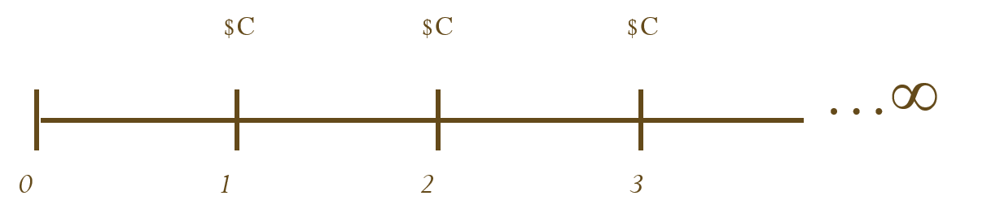
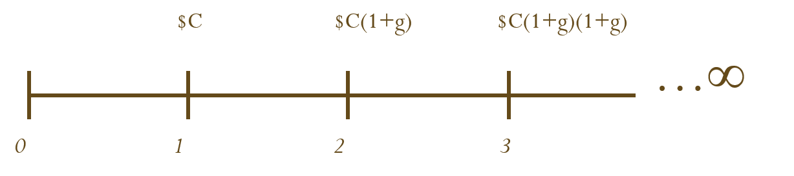
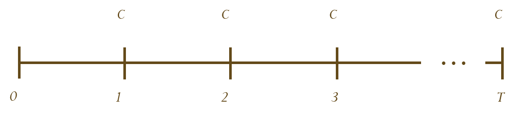
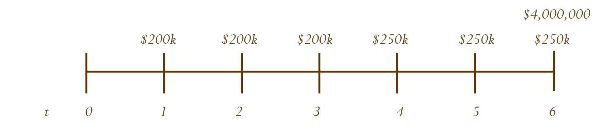

```{css, echo = FALSE}
.remark-slide-content {
  font-size: 18px;
  padding: 20px 80px 20px 80px;
}
.remark-code, .remark-inline-code {
  background: #f0f0f0;
}
.remark-code {
  font-size: 20px;
}
.huge .remark-code { /*Change made here*/
  font-size: 200% !important;
}
.tiny .remark-code { /*Change made here*/
  font-size: 75% !important;
}
```

# Money now vs Money in the future

```{r, echo = F, out.width = "65%", fig.align="center"}
knitr::include_graphics("01-lottery.png")
```

.small[https://globalnews.ca/news/4314259/peterborough-man-7m-lottery-win/]

---
class: left, middle

# One-Period Future Value

.large[
If you were to invest $10,000 at 5% interest for one year, how much would you have at the end of the year?
]
---

# One-Period Future Value

.large[
If you were to invest $10,000 at 5% interest rate for one year, your investment would grow to **$10,500**.

$10,000 is the principal repayment

$500 would be interest: $10,000 $\times$ 0.05

$10,500 is the total due. It can be calculated as:

$$
\$10,500 = \$10,000 \times (1+0.05)
$$

The total amount due at the end of the investment is called the **Future Value (FV)**. What is the formula for **FV**?

$$
FV = PV(1+r)
$$
]
---
class: left, middle

# One-Period Present Value

.large[
If you were promised $10,000, due in one year, when interest rate is 5%. How much would your investment be worth today?
]
---

# One-Period Present Value

.large[
If you were promised $10,000, *due in one year*, when interest rate is 5%, your investment would worth $9,523.81 in *today's dollars*.

$$
\frac{\$ 10,000}{1+0.05} = \$9,523.81
$$

The amount that a borrower would need to set aside today to be able to meet the promised payment of $10,000 in one year is called the **Present Value (PV)** of $10,000. What is the formula for **PV**?

$$
PV = \frac{FV}{1+r}
$$
]
---

# Net Present Value (NPV)

.large[
- The **Net Present Value (NPV)** of an investment is the present value of the expected (future) cash flows, less the cost of the investment.

$$
NPV = -\text{investment} + \frac{CF}{1+r} > 0
$$

- Q: Suppose an investment that promises to pay $10,000 in one year is offered for sale for $9,500. Your interest rate is 5%. Should you invest?

]
---
# Net Present Value (NPV)

.large[

Q: Suppose an investment that promises to pay $10,000 in one year is offered for sale for $9,500. Your interest rate is 5%. Should you invest?

$$
NPV = -\$9,500 + \frac{\$10,000}{1+0.05} = \$23.81 > 0
$$

A: Yes!

**Note**: "Your interest rate" is your **required rate of return**, it is possible that different individuals/entities will have **different** required rates of return.

]
---
class: left, middle

# Multiperiod Future Value

.large[
You have $100 to invest in a bank account that pays an interest rate $r = 6\%$ per year, compounding annually. What is the:

- Future value of investment in year 1?

- Future value of investment in year 2?
]
---
# Multiperiod Future Value

.large[
You have $100 to invest in a bank account that pays an interest rate $r = 6 \%$ per year, compounding annually.

- Future value of investment in year 1:

$$
FV_1 = \$100 \times (1+0.06) = \$106
$$

- Future value of investment in year 2:

$$
FV_2 = FV_1 \times (1+0.06) = \$106 \times 1.06 = \$112.36
$$
Generalized formula for future value after t-periods:

.pull-left[
$$
FV_t = PV \times (1+r)^t
$$
]
.pull-right[.small[
$FV_t = \text{Future Value at time }t$
$PV = \text{Present value at time }0$
$r = \text{Interest rate per compounding period}$
$t = \text{Number of compounding periods}$
]]
]
---
class: left, middle

# Multiperiod Present Value

.large[
You would like to save to purchase a Porsche, 5 years from now that costs $400,000. With interest rate of 8% per year, compounding annually, How much do you need to save today with an 8\% interest rate compounded annually?

]
---
# Multiperiod Present Value

.large[
.pull-left[
$$
PV = \frac{FV_t}{(1+r)^t}
$$
]
.pull-right[.small[
$PV = \text{Present Value at time }0$
$FV_t = \text{Future Value at time }t$
$r = \text{Interest rate per period}$
$t = \text{Number of compounding periods}$
]]

$$
PV = \frac{\$400,000}{(1+0.08)^5} = \$272,233
$$
]
---
# Discount Factor (DF)

.large[

**Discount Factor (DF)** is the Present Value of a future $1.

Therefore,

$$
DF = \frac{1}{(1+r)^t}
$$
and

$$
PV = FV_t \times DF
$$
]
---
class: left, middle

# Exercise: Solve for number of periods
.large[

If we deposit $5,000 today in an account paying 10% interest rate, compounding annually. How long does it take to double our money?

]
---
# Formula Setup

.large[
Recall the Present Value formula:

$$
PV = \frac{FV_t}{(1+r)^t}
$$

We can rearrange the formula to solve for t:

\begin{split}
  &(1+r)^t = \frac{FV_t}{PV} \\
  \Rightarrow \quad &t\text{ log}(1+r) = \text{log}(\frac{FV_t}{PV})\\
  \Rightarrow \quad &t = \frac{\text{log}(\frac{FV_t}{PV})}{\text{log}(1+r)}
\end{split}
]
---
# Answer

.large[
Using the derived formula for t, we can get:

\begin{split}
t &= \frac{\text{log}(\$10,000/\$5,000)}{\text{log}(1+0.1)}\\
&= \text{log }2 / \text{log }1.1\\
&= 7.27 \text{ years}
\end{split}

**Fun fact**: <br>
Compare the answer to the well known [*Rule-of-72*](https://www.investopedia.com/terms/r/ruleof72.asp), which states that:

$$
\text{Years to double} \approx \frac{72}{\text{Interest Rate}}
$$
]
---

class: left, middle

# Real Life Example: Solve for Interest Rate

.large[
In 1626, Dutch Settlers who were representatives of the West India Company, which was publicly traded at the time, purchased the Island Manhattes from the Indians for a value of 60 guilders (equivalent to 24 1626 US Dollars). 

According to Bloomberg, commercial and residential properties in Manhattan were worth roughly $483.6 billion. 

What was the rate of return on this purchase? 

.pull-left[Was it a good deal?]
.pull-right[
```{r, echo = F, out.width = "70%", fig.align="left"}
knitr::include_graphics("02-manhattan.jpg")
```
]
]
---

# Formula Setup

.large[
Recall the Present Value formula:

$$
PV = \frac{FV_t}{(1+r)^t}
$$

We can rearrange the formula to solve for r:

\begin{split}
&(1+r)^t = \frac{FV_t}{PV}\\
\Rightarrow \quad &1+r = \Big(\frac{FV_t}{PV}\Big)^{\frac{1}{t}}\\
\Rightarrow \quad &r = \Big(\frac{FV_t}{PV}\Big)^{\frac{1}{t}}-1
\end{split}
]
---

# Answer

.large[
Using the derived formula for t, we can get:

\begin{split}
r &= \Big(\frac{FV_t}{PV}\Big)^{\frac{1}{t}}-1\\
&= \Big(\frac{\$483,600,000,000}{\$24}\Big)^{\frac{1}{2018-1626}}-1\\
&= 6.24\%
\end{split}
]
.pull-left[.large[
So... Was it worth?
]]

.pull-right[**Things we did not account for**:

  - Cost of developing the Manhattan area.
  
  - Income and benefits of the Manhattan area.
  
  - Many other issues...]

---
# APR vs EAR

.large[
Until now we have been assuming that interest is compounded annually. But what if interests are compounded more (or less) frequently? 
]

- .large[**Annual Percentage Rate (APR)** is the stated or quoted annual interest rate without compounding.]

  - e.g. An APR of 12% compounding quarterly means that it will pay 3% per quarter. The interest will then compound every 3 months (4 times per year).
  
  - $1 investment in a 12% APR with quarterly compounding would be worth $(1+0.03)^4 = 1.1255$ next year.

- .large[**Effective Annual Rate (EAR)** is the interest rate that is annualized using compound interest.]

  - e.g. In the example above, the EAR is 12.55%.
  
---

# APR vs EAR (conversion)

.large[We can convert between APR and EAR using the following formula:

\begin{split}
&(1+EAR)^t = (1+\frac{r}{m})^{mt}\\
\Rightarrow \quad &(1+EAR) = (1+\frac{r}{m})^m
\end{split}

Where:

  - r = Nominal interest rate per year (APR)
  
  - m = Number of compounding periods per year 
  
    - m = 2 if semi-annual, m = 4 if quarterly, m = 12 if monthly, etc.]
    
---
class: left, middle

# APR vs EAR Exercise

.large[
If you invest $500 for 5 years at 12% APR compounded semi-annually, what will be the future value of your investment be?

- What is the effective annual rate of this investment?
]

---
# APR vs EAR Answer

\begin{split}
  FV_5 &= PV \times (1+\frac{r}{m})^{mt}\\
  &= 500 \times (1+\frac{0.12}{2})^{2\times 5}\\
  &= 500 \times 1.06^{10}\\
  &= 895.42
\end{split}

.large[The investment will be worth $895.42 after 5 years.]<br><br>

\begin{split}
  EAR &= (1+\frac{r}{m})^m -1\\
  &= 1.06^2 - 1\\
  &= 12.36\%
\end{split}

.large[The effective annual rate is 12.36%.]

---
# Continuous Compounding

.large[
The general formula for the future value of an investment compounded continuously over t years can be written as:

$$
FV_t = PV \times e^{rt}
$$
Where:
]
  - PV is the present value of the cash flow at time 0.
  
  - r is the APR.
  
  - t is the number of years over which the cash is invested.
  
  - e is Euler's number ( $e \approx 2.718$ ). $e^x$ is the exponential function and also a key on your calculator. <br><br><br><br>
  
.small[Note: For those who are interested in the mathematical derivation of the formula, [here](https://www.youtube.com/watch?v=zMeYrkLAqi4) is a youtube video for that. (Not required for the course)]
---

# Short Recap

.large[
We learned to:

- Compare cash flows that occur at different points in time.

- Determine economically equivalent future values from values that occur in previous periods through compounding.

- Determine economically equivalent present values from cash flows that occur in the future through discounting.
]

---
# Back to the lottery

```{r, echo = F, out.width = "65%", fig.align="center"}
knitr::include_graphics("01-lottery.png")
```

Which one would you pick?
---

# Perpetuities and Annuities

.large[**Perpetuity**]

  - A constant stream of cash flows that continues forever.
  
.large[**Growing Perpetuity**]

  - A stream of cash flows that grows at a constant rate and continues forever.
  
.large[**Annuity**]

  - A stream of constant cash flows that lasts for a fixed number of periods.
  
.large[**Growing Annuity**]

  - A stream of cash flows that grows at a constant rate for a fixed number of periods.
  
---

# Perpetuities

.large[
- A constant stream of cash flows that continues forever.
]



.large[
$$
PV_0 = \frac{C}{r}
$$

Note: We are calculating the present value at *year 0*, but the first cash flow comes in *year 1*.
]
---

# Growing Perpetuities

.large[
- A stream of cash flows that grows at a constant rate *g* forever.
]



.large[
$$
PV_0 = \frac{C}{r-g}
$$
]

---
class: left, middle

# Perpetuity Exercise

.large[
The expected dividend next year is $1.30 and the same amount of dividend is expected to be paid every year in the future. The discount rate is 10%.

- What is the present value of this dividend stream?

- If the dividends are expected to grow at 5% every year forever (instead of being the same every year), what is the present value of the dividend stream?
]
---

# Perpetuity Exercise Answers

.large[
$1.30 every year:

$$
PV = \frac{C}{r} = \frac{1.30}{0.1} = \$13
$$

$1.30 at year 1 and grows at 5% each year forever:

$$
PV = \frac{C}{r-g} = \frac{1.30}{0.1-0.05} = \$26
$$
]
---

# Annuity

.large[
A constant stream of cash flows with a fixed maturity *t*:
]



.large[
$$
PV = \frac{C}{(1+r)} + \frac{C}{(1+r)^2} + \frac{C}{(1+r)^3} + ... + \frac{C}{(1+r)^t}
$$
]

.pull-left[
The formula for the present value of an annuity is:
]
.pull-right[.large[
$$PV = \frac{C}{r}\bigg[1-\frac{1}{(1+r)^t}\bigg]$$
]]

---

# Growing Annuity

.large[
A growing annuity is a stream of cash flows growing at rate *g* with a fixed maturity *t*.

$$
PV = \frac{C}{1+r} + \frac{C\times(1+g)}{(1+r)^2} +...+ \frac{C\times(1+g)^{t-1}}{(1+r)^t}
$$

The formula for the present value of a growing annuity is:


$$
PV = \frac{C}{r-g}\bigg[1-\bigg(\frac{1+g}{1+r}\bigg)^t\bigg]
$$
]
---
class: left, middle

# Annuity Exercise

.large[
A retirement plan will payout $20,000 at the end of every year for the next 40 years. The discount rate is 10%. 

- What is the present value of the retirement plan?

- If the retirement plan payout increases by 3% every year, starting at $20,000 in the first year, what is the present value of the retirement plan?
]
---

# Annuity Exercise Answers

.large[
PV of annuity retirement plan:
]

\begin{split}
PV &= \frac{C}{r}\bigg[1-\frac{1}{(1+r)^t}\bigg]\\
&= \frac{20,000}{0.1}\bigg[1-\frac{1}{(1+0.1)^{40}}\bigg]\\
&= \$195,581
\end{split}

.large[
PV of growing annuity retirement plan:
]

\begin{split}
PV &= \frac{C}{r-g}\bigg[1-\bigg(\frac{1+g}{1+r}\bigg)^t\bigg]\\
&= \frac{20,000}{0.1-0.03}\bigg[1-\bigg(\frac{1+0.03}{1+0.1}\bigg)^{40}\bigg]\\
&= \$265,122
\end{split}

---

# Tips for Solving Time Value of Money Problems


- .large[Draw a timeline that precisely identifies when cash flows occur.]

- .large[Find an anchor - either the present value or future value of the cash flow stream.]

- .large[Make sure that your discount rate matches the compounding and payment frequencies.]

  - Do not confuse APR with EAR
  
  - Maintain consistency between the interest rate and the number of periods.

- .large[
Be careful: The perpetuity and annuity formulas assume that the first payment occurs at time $t = 1$.
]

---
class: left, middle

# Example: More Complicated Cash Flows

.large[
You are planning to buy a property. You think that you can sell it in six years for $4,000,000. You also expect to earn rent of $200,000 per year for the first 3 years (starting at the end of this year), and $250,000 for the following 3 years. The interest rate is 8%. How much would you be willing to pay for it today?

<br><br>

Hint: you can value any complicated stream of cash flows by splitting that stream into separate cash flows, annuities, and/or perpetuities.
]
---

# Answer

.large[First, draw a timeline for the cash flows:]


.large[
The brute force way (Sum up the PV of each cash flow):
]

\begin{split}
PV = &\frac{200,000}{(1+0.08)} + \frac{200,000}{(1+0.08)^2} + \frac{200,000}{(1+0.08)^3} + \frac{250,000}{(1+0.08)^4}\\
&+ \frac{250,000}{(1+0.08)^5} + \frac{4,250,000}{(1+0.08)^6}
\end{split}

---

# Answer (cont'd)

.large[
Or, we can break down the cash flows into:

1. An annuity from year 1 to 3 for $200,000 each year.

2. An annuity from year 4 to 6 for $250,000 each year.

3. A cash flow of $4,000,000 in year 6.
]

\begin{split}
PV = &\frac{200,000}{0.08}\bigg[1-\frac{1}{(1+0.08)^3}\bigg] + \frac{250,000}{0.08}\bigg[1-\frac{1}{(1+0.08)^3}\bigg]\bigg[\frac{1}{(1+0.08)^3}\bigg] \\
&+ \frac{4,000,000}{(1+0.08)^6}
\end{split}

.large[
Both methods should yield the same result: $$ PV = \$ 3,547,544 $$
]

---
# In Summary

.large[
We learned how to:
]

  - Compare cash flows that occur at different points in time.
  
  - Determine economically equivalent future values from values that occur in previous periods through compounding.
  
  - Determine economically equivalent present values from cash flows that occur in the future through discounting.
  
  - Find present value of perpetuities and growing perpetuities.
  
  - Find present value and future values of annuities and growing annuities.

---

# What can we do with these numbers?

1. Managers might evaluate two projects
2. Investors might compare investments
3. Loan officers decide on a loan
4. Financial manager may decide to raise equity or borrow money
5. A retiree might sell her house an invest in an annuity

---
# Formula Sheet

$$ PV = \frac{FV_t}{(1+r)^t} $$
$$ FV_t = PV(1+r)^t $$
$$ PV(\text{Perpetuity}) =\frac{C}{r}$$
$$ PV(\text{Annuity}) = \frac{C}{r}\bigg[1-\frac{1}{(1+r)^t}\bigg]$$
$$ PV(\text{Growing Perpetuity}) = \frac{C}{r-g}$$
$$ PV(\text{Growing Annuity}) = \frac{C}{r-g}\bigg[1-\bigg(\frac{1+g}{1+r}\bigg)^t\bigg]$$
$$ 1 + EAR = (1+\frac{APR}{m})^m$$
$$ FV_t(\text{Continuous Compounding}) = e^{rt}$$
