```{css, echo = FALSE}
.remark-slide-content {
  font-size: 18px;
  padding: 20px 80px 20px 80px;
}
.remark-code, .remark-inline-code {
  background: #f0f0f0;
}
.remark-code {
  font-size: 20px;
}
.huge .remark-code { /*Change made here*/
  font-size: 200% !important;
}
.tiny .remark-code { /*Change made here*/
  font-size: 75% !important;
}
```

# How do companies make investment decisions?

```{r, echo = F, out.width = "65%", fig.align="center"}
knitr::include_graphics("01-tesla.png")
```

.small[https://www.statesman.com/business/20200722/tesla-picks-austin-for-1-billion-auto-factory]

---

# Investment Decisions Overview

.large[
- Investment Evaluation Methods

  - Net Present Value (NPV)
  
  - Internal Rate of Return (IRR)
  
      - Incremental IRR
  
  - Payback Period (PP)
  
  - Profitability Index (PI)
  
- Strengths and Weaknesses of these measures
]
---

# Brief Steps of Investment Decision Making

.large[
1. Forecast **project cash flows**.

2. Estimate cost of capital *r*, or sometimes refered as **WACC**(Weighted Average Cost of Capital)
  
  - We will focus more on this in topic 6: Cost of Capital

3. Evaluate projects using one or more methods

  - NPV, IRR, PP, PI
  
Accept or reject project(s) based on one or more of the evaluation criteria.
]

---

# Net Present Value (NPV)

.large[
**NPV**: Present value of all future cash inflows discounted at cost of capital *r* minus the initial investment
]

.pull-left[
$$
NPV(\text{project}) = \sum_{t=1}^T\frac{CF_t}{(1+r)^t}-C_0
$$
]
.pull-right[
$C_0$: Initial investment for the project
$CF_t$: Cash flow of project at time *t*
]

<br><br>

- .large[NPV investment rules:]

  - $NPV > 0 \rightarrow$ Accept project
  
  - $NPV < 0 \rightarrow$ Reject project
  
  - If projects are mutually exclusive (i.e. Picking one project out of several projects), choose the project with the highest NPV.

---

# NPV: an Example

.large[
Bob's Shoes is evaluating two possible expansion projects, to New York and/or to Chicago. Cost of capital is 10%. Below are the expected cash flows of the project:
]

.center[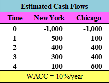]
$$
NPV(\text{New York}) = \frac{500}{1.1}+\frac{400}{1.1^2}+\frac{300}{1.1^3}+\frac{100}{1.1^4}-1,000 = \$ 78.82
$$
$$
NPV(\text{Chicago}) = \frac{100}{1.1}+\frac{400}{1.1^2}+\frac{400}{1.1^3}+\frac{600}{1.1^4}-1000 = \$ 131.82
$$

.large[What would you recommend?]
---

# The Decision

.large[
- If projects are *independent* and the firm has sufficient capital to finance both projects, **accept all positive NPV projects**!

  - Therefore, they should expand to both Chicago and New York.
  
- If the porjects are mutually exclusive (can only accept one or another), **choose the investment with the highest NPV**!

  - Therefore, they should expand to Chicago. ($131.82 > $78.82)
  
*Note*: the NPV of a project typically declines as the discount rate/cost of capital rises. (Any exceptions?)
]
---

# What is NPV and is it any good?

.large[
- NPV represents the expected change in firm value from undertaking the project.

  - $NPV > 0 \rightarrow \text{Increases firm value}$
  
  - $NPV < 0 \rightarrow \text{Destroys firm value}$
 
- Strengths of NPV

  - NPV takes into account of all future cash flows related to the project.
  
  - NPV discounts cash flows correctly.
  
  - NPV tells you exactly how much value is added to the firm.
  ]
  
---

# Internal Rate of Return (IRR)

.large[
**IRR** is the *hypothetical* discount rate that makes the NPV of a project equal to 0.
]
$$
\sum_{t=1}^T\frac{CF_t}{(1+IRR)^t} -C_0 = 0
$$
Note: For prjects with multiperiod cash flows, it is difficult to calculate the IRR algebrically. You can use the *graphing* method, a *financial calculator*, or an *[online IRR calculator](https://www.calculatestuff.com/financial/irr-calculator)* to find the IRR.

.large[IRR investment rules:]
  
  - $IRR > r \rightarrow \text{Accept project}$
  
  - $IRR < r \rightarrow \text{Reject project}$
  
  - IRR rule will often, *but not always*, coincide with the NPV rule.

---

# IRR: an Example

.center[]

**New York:**
$$
-1000 + \frac{500}{1+r} + \frac{400}{(1+r)^2} +\frac{300}{(1+r)^3}+\frac{100}{(1+r)^4} = 0 \quad \quad IRR = 14.49\%
$$

**Chicago:**
$$
-1000 + \frac{100}{1+r} + \frac{400}{(1+r)^2} +\frac{400}{(1+r)^3}+\frac{600}{(1+r)^4} = 0 \quad \quad IRR = 14.82\%
$$

Therefore, pick Chicago (IRR = 14.82%) if the projects are mutually exclusive. Accept both if the projects are independent (Both IRRs of New York and Chicago projects are greater than 10%).
---

# IRR: Complications

- .large[Does the NPV rule always give the same answer as the IRR rule?]

- .large[Problems with the IRR approach:]

  - .large[Issues affecting ***both*** independent and mutually exclusive projects:]
      
      - "Investing" vs "Financing"
      
      - Multiple IRR solutions
      
  - .large[Issues affecting ***only*** mutually exclusive projects:]
  
      - The scale problem
      
      - The timing problem
      
---
class: left, middle

# Investing vs Financing: an Example

.large[
Prof. Riordan was recently asked to write a textbook for intro to finance.

He took an up front payment of $1,000,000 and was expected to deliver a completed text in 3 years. He figtures that based on his consulting rates it will cost him $500,000 a year to complete the book. If current interest rates are 10%, based on the IRR criteria, what should he have done? What about the NPV method?
]
---

# IRR: the graphing method

.large[
- Step 1: Plug in a range of *r* and calculate the respective NPVs

- Step 2: Connect the dots

Note: the x-intercept of the graph shows the *r* when NPV = 0, i.e. the IRR.
]

```{r, echo = F, out.width = "65%", fig.align="center"}
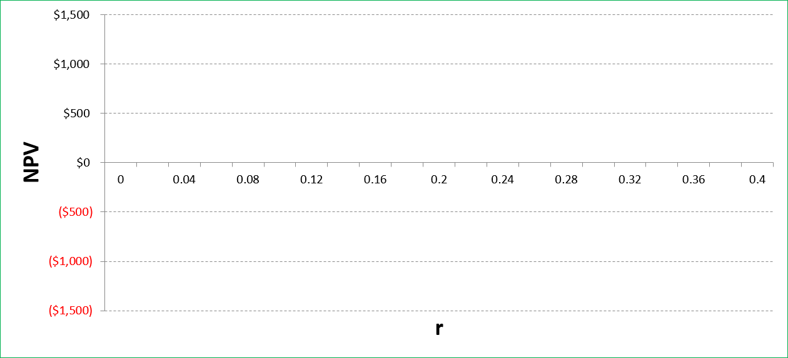
```
---

# Prof. Riordan's Book Project

```{r, echo = F, out.width = "80%", fig.align="center"}
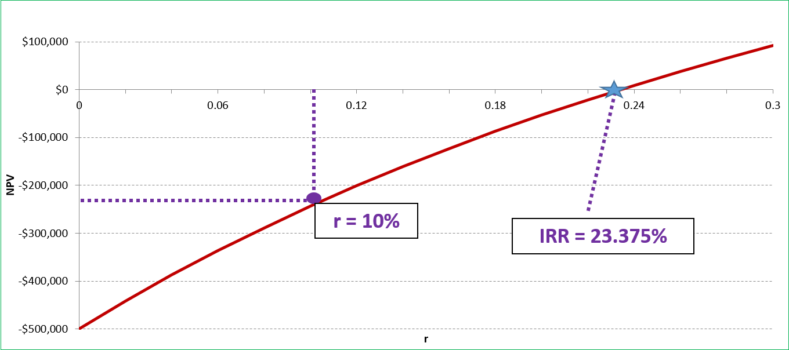
```

- Prof. Riordan's deal can be seen as a **financing** opportunity:
  - He *receives* cash at time 0 and *pays out* over three years
  - Cash inflows precedes cash outflows - Different from our previous examples.
  
- In the case of a **financing** oppotunity , the IRR decision rule "reverses"
  - if IRR < discount rate $\rightarrow$ Accept project
  - If IRR > discount rate $\rightarrow$ Reject project
  
---

# IRR for **financing** type projects

.large[
- **Financing** type projects are those for which you get cash upfront which is positive followed by negative cash flows in the future.

- The decision rule for financing type projects is the opposite to that for investing/normal type projects:

  - Accept if IRR < required rate
  
  - Reject if IRR > required rate
  
- NPV decision rules are still the same.
]

---
class: left, middle
# Multiple IRRs

Suppose Prof. Riordan's deal also includes royalty cash flows which are expected to be $30,000 per year for the next 30 years after the book is completed. 

Now what should his decision be using the IRR rule?

What does the timeline look like?
---

# Prof. Riordan's Book Project <br> (with royalties)

```{r, echo = F, out.width = "60%", fig.align="center"}
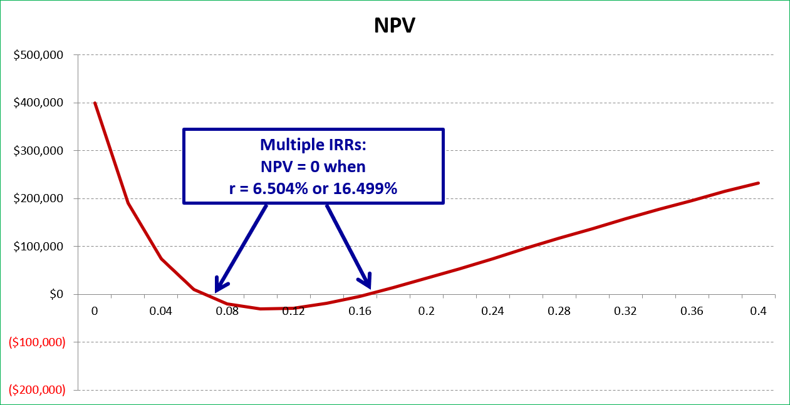
```

- If cash flows "flip-flop", may obtain non-unique IRR values:
  - NPV > 0 if discount rate is *low* or *high*
  - NPV < 0 for *moderate* discount rates
  
- Why is this happening? Is this an investing or financing project? What should the IRR decision rule be?
- A simpler solution would be: **Just use the NPV decision rule.**
---

# The Scale Problem

Suppose we can expand to either Houston or San Antonio:

.center[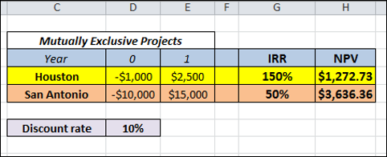]

.large[
We have a conflict. The IRR rule chooses the Houston project but San Antonio has a much higher NPV. Why is this happening?
]

Solutions to the **scale problem**:

- Just use NPV rule

- Incremental IRR
---

# Incremental IRR

.large[
Do the difference between the two projects and calculate the IRR, then compare that IRR to the cost of capital.
]

```{r, echo = F, out.width = "60%", fig.align="center"}
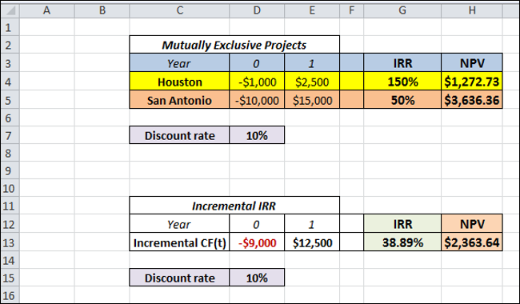
```

.large[
What should be the decision based on incremental IRR?
]

---

# The Timing Problem

```{r, echo = F, out.width = "90%", fig.align="center"}
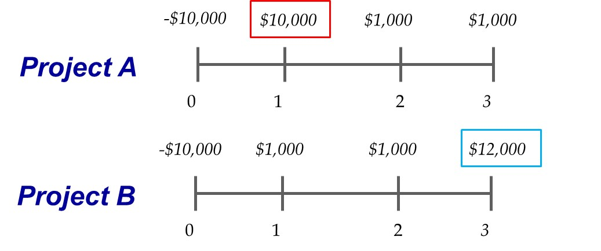
```

.large[
- The preferred project in this case depends on the discount rate, not the IRR.

- Both projects have a large cash flow but time value of money will affect the final decision.
]
---

# The Timing Problem

.pull-left[
- The preferred project in this case depends on the discount rate, not the IRR.

- There is a point at which both projects have a negative NPV

- At lower discount rates, Project B is preferred to Project A

- At higher discount rates, Project A is preferred to Project B  

- Where is the *crossover rate*?
]
.pull-right[
```{r, echo = F, out.width = "90%", fig.align="center"}
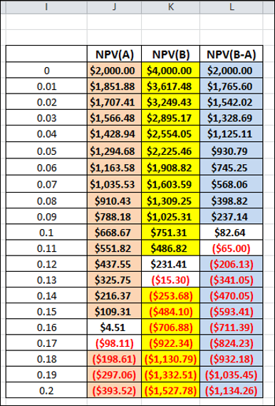
```
]

---

# The Timing Problem: Incremental IRR

.large[
- To find the *crossover rate*, use incremental cash flows (blue row)

- Compute the IRR after taking the difference between Project B and Project A cash flows

- The crossover rate (IRR of B-A) ≈ 10.55%
]

```{r, echo = F, out.width = "50%", fig.align="center"}
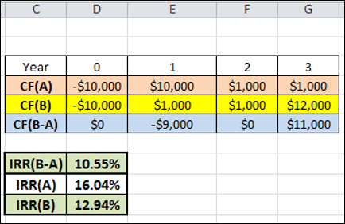
```

---

# Calculating the Crossover Rate

.large[
- Should you compute the incremental IRR for (A-B) or (B-A)?

- The suggestion is to *perform the substraction so that the first nonzero cash flow is negative* (i.e. In this case, B-A)

- This makes the incremental project an "*investing* project" so that the ultimate decision is more intuitive (Choose B over A if IRR > *r*) 
]
.pull-left[
```{r, echo = F, out.width = "120%", fig.align="center"}
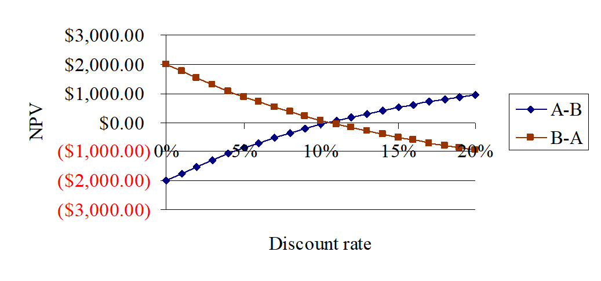
```
]
.pull-right[
```{r, echo = F, out.width = "100%", fig.align="center"}
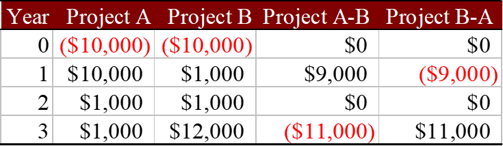
```
]
---

# Timing Problem: Graphical Solution

```{r, echo = F, out.width = "100%", fig.align="center"}
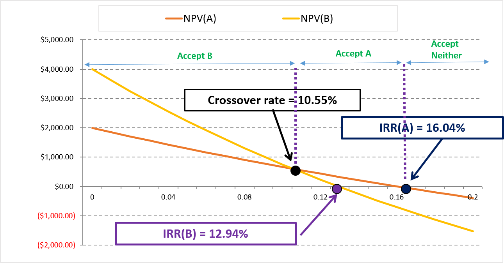
```
---

# Payback Period (PP)

.large[
**PP**: Amount of time required for an investment to generate sufficient cash flows to recover its initial cost.

Payback Period decision rule:

- A project is accepted if its packback period is less than a specified cutoff period (usually 2-3 years).
]

---

# Payback Period: an Example

.large[
Back to the New York and Chicago example. Using the payback period as decision criteria. Assume a payback period cutoff of 3 years.
]

```{r, echo = F, out.width = "90%", fig.align="center"}
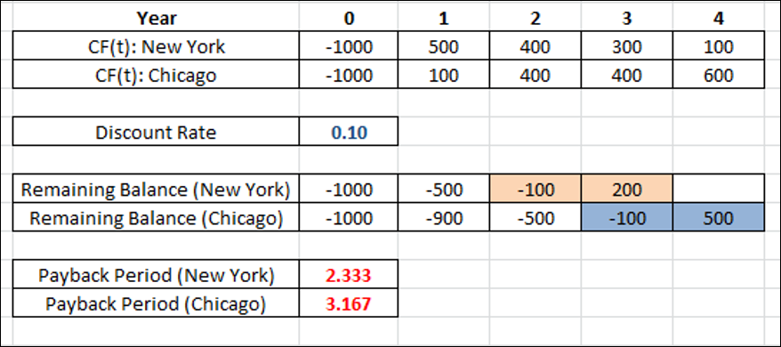
```

.large[
We would accept New York and reject Chicago.
]
---

# Payback Period: Pros and Cons

.large[Pros:]

- Very simple to calculate and easy to understand

  - Useful for small day-to-day decisions
  
- May be useful for firms with limited access to capital

  - Focus on *quick cash recovery*
  
.large[Cons:]

- Timing of cash flows is ignored (recall that using the NPV method, the Chicago expansion was worth $131.82 and the New York expansion was only worth $78.82)

- Cash flows after the payback period are ignored

- Arbitrary benchmark: 2 years? 3 years? more/less?
---

# Profitability Index (PI)

.large[
**PI**: Amount of dollars (in present value) generated per dollar investment.

$$
PI = \frac{\sum_{t=1}^T \frac{CF_t}{(1+r)^t}}{C_0}
$$
]

.large[
Profitability Index investment rules:
 
  - PI > 1 → Accept project
  
  - PI < 1 → Reject project
]
---

# Profitability Index: Pros and Cons

.large[
Pros: Capital Rationing

  - Since firms may not have sufficient capital to fund all positive NPV projects.
  
  - By ranking projects using PI and choosing the highest PI project(s), firms get the best "bang for buck" project.
  
Cons:

  - Does not account for the scale of the project.
  
  - Projects with lower PI may have higher NPV due to larger cash flow sizes but requires larger amount of initial investment.
]
---

# What do CFOs use in practice?

```{r, echo = F, out.width = "100%", fig.align="center"}
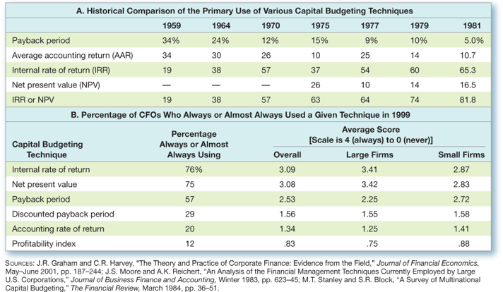
```

---

# Formula Sheet

$$
NPV = \sum_{t=1}^T\frac{CF_t}{(1+r)^t}-C_0
$$

$$
\sum_{t=1}^T\frac{CF_t}{(1+IRR)^t} -C_0 = 0
$$
$$
PI = \frac{\sum_{t=1}^T \frac{CF_t}{(1+r)^t}}{C_0}
$$
