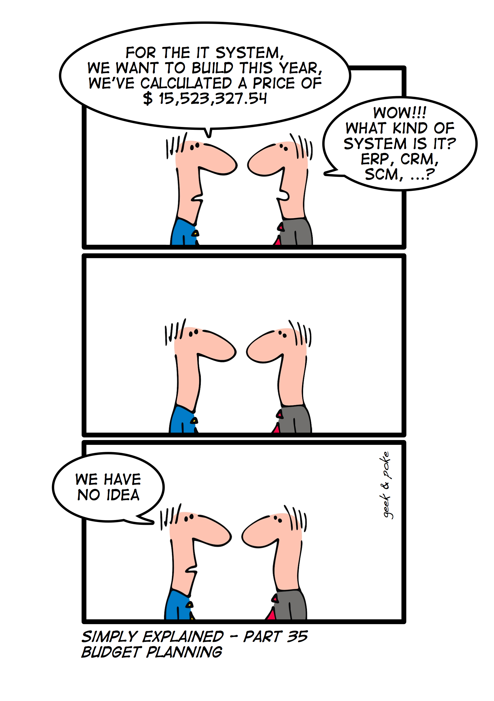

# How much does an investment cost?

As satirical as the comic is, the guy was doing a great job as a finance advisor, since he was able to figure out the cost of building the IT system. (Without knowing anything about it!)
---

# Capital Budgeting

.large[
- Now that we have a handle on how to calculate a project's NPV, we need to be able to estimate the costs of potential projects and the future revenues. 

- For an N year project, here is what we do:

  1. Estimate the free cash flow (**FCF**) of every year.
  
  2. Estimate operating cash flows ( $CF_t$ )
  
  3. Estimate ending cash flows ( $CF_N$ )
]
---

# Considerations

- .large[Cannibalism]
  - Introduction of new product that **cannibalizes** revenue of an existing product. (Cost)

- .large[Synergies]
  - Introduction of new product that **boosts** revenue of an existing product. (Benefit)
  
- .large[Interest Expenses]
  - Projects financed with debts have an interest expense. What is the change of interest expense if we decide to invest in this project?
  
- .large[Discount cash flows]
  - Cash flows must be discounted at appropriate discount rates.
  
---

# Taxes and Depreciation

- 
