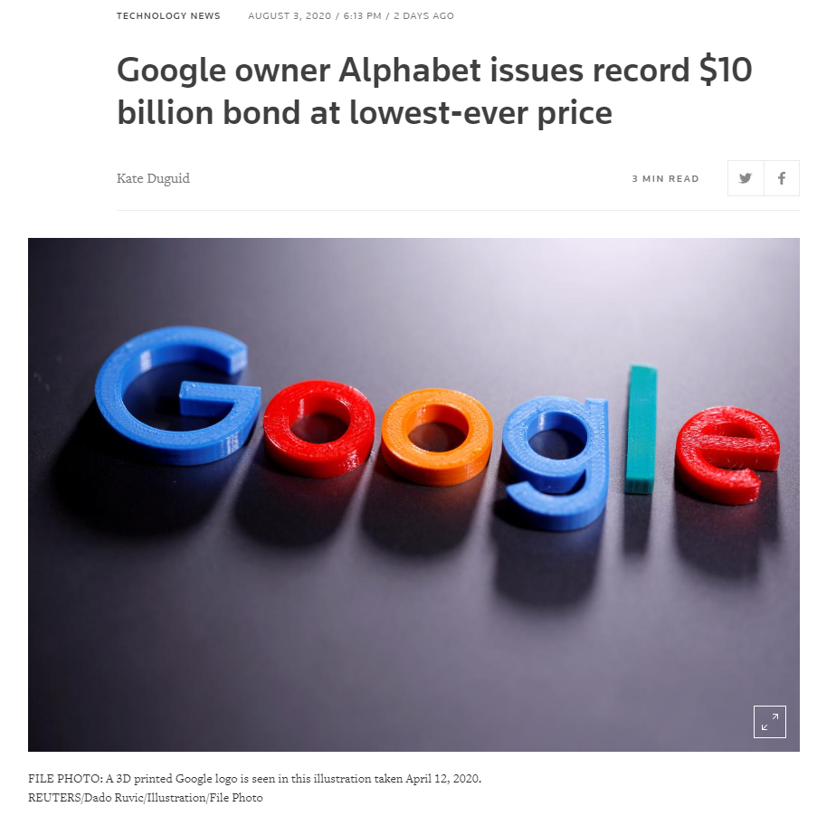
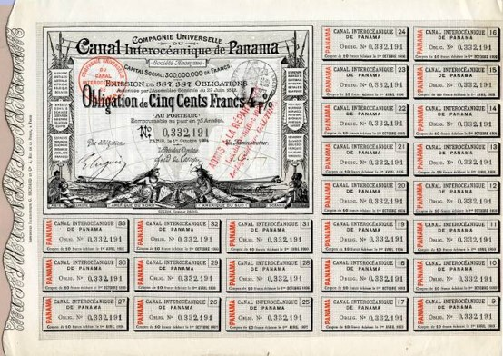
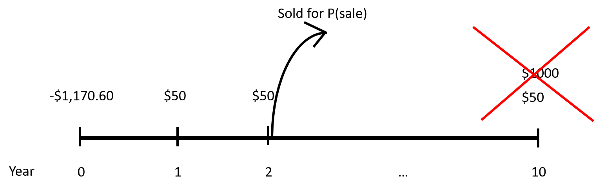
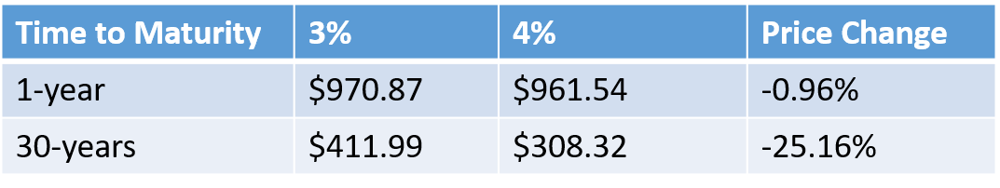
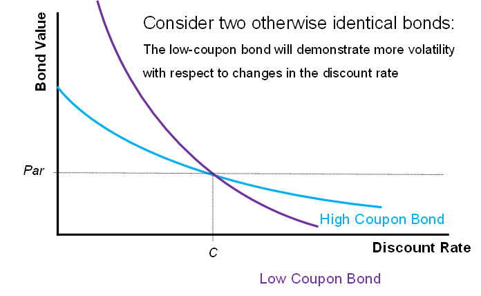
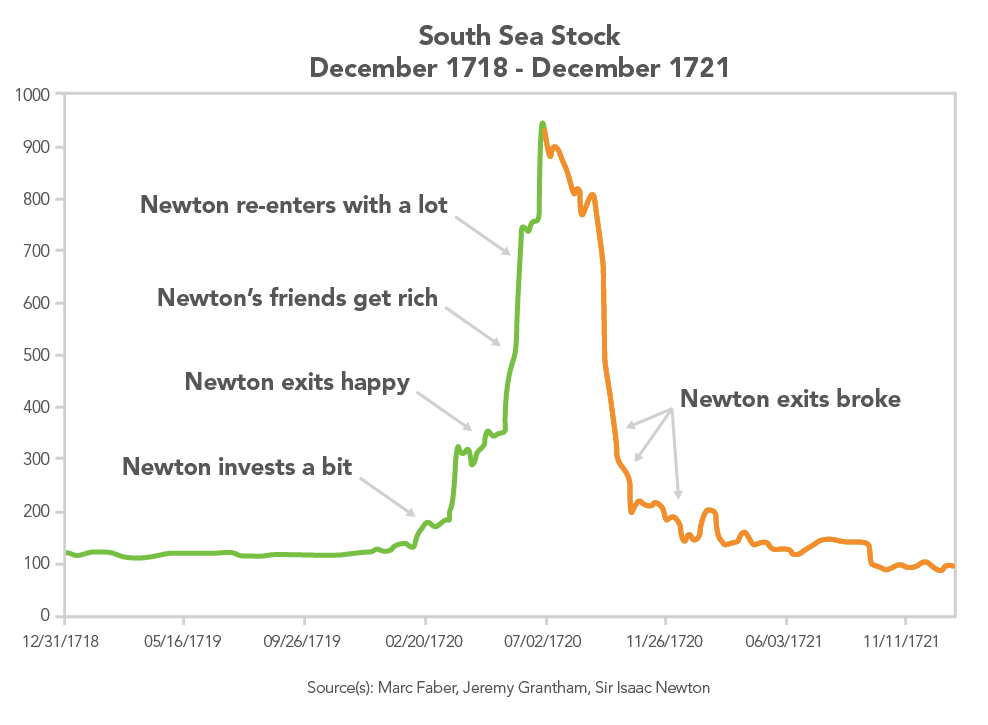
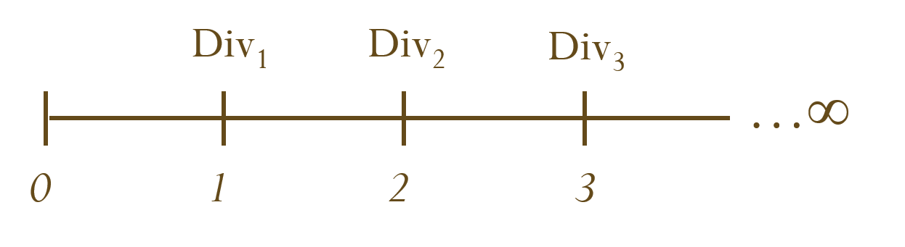
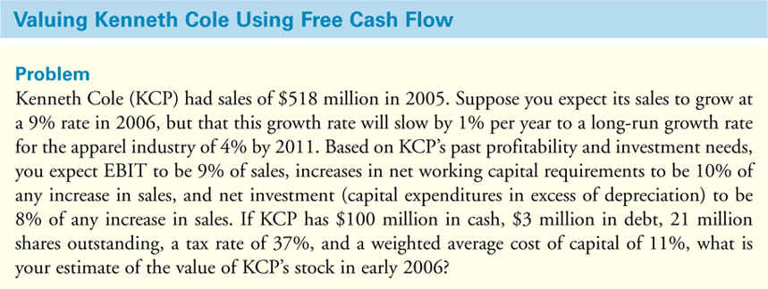
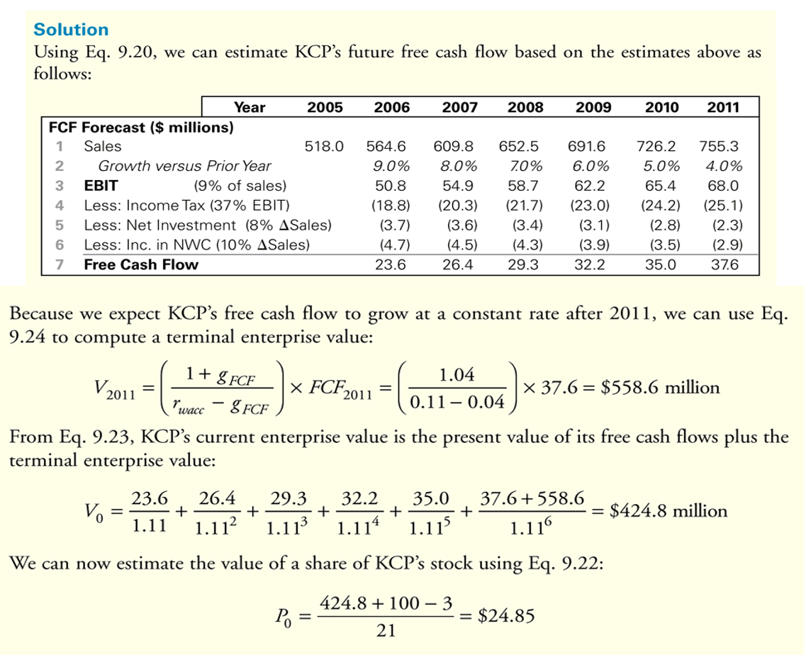

```{css, echo = FALSE}
.remark-slide-content {
  font-size: 18px;
  padding: 20px 80px 20px 80px;
}
.remark-code, .remark-inline-code {
  background: #f0f0f0;
}
.remark-code {
  font-size: 20px;
}
.huge .remark-code { /*Change made here*/
  font-size: 200% !important;
}
.tiny .remark-code { /*Change made here*/
  font-size: 75% !important;
}
```

# Overview

.large[
- Bond

- Stock

  - Valuation
  
  - Discounted Cash Flow (DCF)
  
  - Multiples
]

---

# Bond

.pull-left[
```{r, echo = F, out.width = "60%", fig.align="center"}

```

What are these terms?

- Cost of Financing
- Coupon
- Maturity

Most importantly, what are **BONDS**?
]
.pull-right[
> "NEW YORK (Reuters) - Alphabet Inc (GOOGL.O) borrowed $10 billion in the investment-grade corporate debt market on Monday, the Google parent’s largest ever bond issue, which it secured at its lowest-ever cost of financing.

> Of the $10 billion on offer, the $1 billion five-year tranche was issued at a coupon of 0.45%, the lowest coupon seen on a U.S. corporate bond at that maturity, according to Refinitiv data, which goes back to 1980."

> --- August 3rd, 2020

.small[https://www.reuters.com/article/us-alphabet-bonds/google-owner-alphabet-issues-record-10-billion-bond-at-lowest-ever-price-idUSKCN24Z2PC]
```{r, echo = F, out.width = "25%", fig.align="center"}
knitr::include_graphics("02-james.jpg")
```
]
---

# Bond

.pull-left[.large[
**Bond** is a security sold by a government or a corporation to raise money from investors in exchange for a promised future payment.

<br><br>

Examples: T-Bills, T-Notes, T-Bonds, Commercial Paper, Corporate Bonds, Municipal Bonds, Mortgage-backed Securities, Asset-backed Securities, etc.
]]
.pull-right[
```{r, echo = F, out.width = "100%", fig.align="center"}

```
]
---

# Bonds: Terminology

.large[
Maturity (n): The final repayment date of a bond.

Coupon payment (**CPN**): The promised interest payments of a bond, paid periodically until maturity.

Face Value (**FV**) / Par value / Principal value: The notional amount of the bond used to compute the interest. The face value is typically repaid at maturity.

Yield to Maturity (**YTM**): The **YTM** is the Return on Investment (**ROI**) in a bond that is held to its maturity date. It is essentially the **IRR** taking considerations of the current market price of the bond and the future cash flows of the bond.

Coupon rate: The sum of all coupon payments in 1 year divided by the face value of the bond.
]

---

# Bond: Example

.large[
A bond with par value $1,000 with 8% coupon and semi-annual payments, maturing in 5 years.

This means that:
]

- $1,000 x 8% = $80 coupon payment per year.

- Since coupons are paid semi-annually, $80 / 2 = $40 will be paid every 6 months as coupon payments.

- $1,000 face value will be repaid at year 5.
```{r, echo = F, out.width = "80%", fig.align="center"}
knitr::include_graphics("04-couponbond.png")
```
---
class: left, middle

# Bond Price

.large[
How to Price bonds?

Treat it as a Time Value of Money (TVM) problem!
]
---

# Zero-Coupon Bond

.large[
A zero-coupon bond pays only the face value at maturity.

Recall the TVM formula:

$$
FV_t = PV\times(1+r)^t
$$
]

where FV<sub>t</sub> is future value at year t, PV is present value, r is interest rate.

Translating to "Bond language", a zero-coupon bond would have the following formula:
.pull-left[
$$
FV = P\times(1+YTM_n)^n\qquad \text{or}
$$
]
.pull-right[
$$
P = \frac{FV}{(1+YTM_n)^n}
$$
]

where FV is face value, P is price, YTM<sub>n</sub> is yield-to-maturity (as the effective rate per period), n is time to maturity (in terms of no. of compounding periods).

Note: n is the year to maturity and YTM<sub>n</sub> is the EAR only when the the interest is compounded annually.

---
# Zero-coupon Bond: Example

.large[
What is the market price of a zero-coupon bond with face value $50,000, 25 years to maturity, and 6% YTM?
]

---
# Zero-coupon Bond: Example

.large[
What is the market price of a zero-coupon bond with face value $50,000, 25 years to maturity, and 6% YTM?

Answer:

\begin{split}
P &= \frac{FV}{(1+YTM_n)^n}\\
&= \frac{50,000}{(1+0.06)^{25}}\\
&= \$11,655
\end{split}
]
---

# Coupon Bond

.large[
A coupon bond can be considered as 2 separate cash flows:

1. An annuity of coupon payments

2. A zero-coupon bond that repays the face value at maturity.

Combining these two cash flows, we get the formula for pricing a coupon bond:

$$
P = \frac{CPN}{YTM_n}\bigg[1 - \frac{1}{(1+YTM_n)^n}\bigg]+\frac{FV}{(1+YTM_n)^n}
$$
The first term is the annuity portion of the coupon, and the second term is the zero-coupon bond portion.
]

Note: You have to use YTM<sub>n</sub> and n corresponding to the coupon payment intervals. e.g. If coupon is paid<br>semi-annually, $n = \text{year-to-maturity}\times 2$, YTM<sub>n</sub> is the effective rate over 6 months.

---

# Coupon bond: Example

.large[
A bond with $1,000 par value, 5 years to maturity, 5% coupon rate paid semi-annually. If the bond has YTM of 6% (APR compounded semi-annually), what is the price of the bond?
]
---

# Coupon bond: Example

.large[
A bond with $1,000 par value, 5 years to maturity, 5% coupon rate paid semi-annually. If the bond has YTM of 6% (APR compounded semi-annually), what is the price of the bond?

$$
FV = \$1,000
$$
$$
CPN = \frac{5\% \times \$1,000}{2} = \$25 \quad\text{every 6 months}
$$
$$
n = 5 \times 2 = 10 \quad\text{semi-annual periods}
$$
$$
YTM_{10} = 6\%/2 = 3\% \quad \text{effective semi-annual rate}
$$
]
---

# Coupon bond: Example cont'd

.large[
Use the coupon bond formula:

\begin{split}
P &= \frac{CPN}{YTM_n}\bigg[1 - \frac{1}{(1+YTM_n)^n}\bigg]+\frac{FV}{(1+YTM_n)^n}\\
&= \frac{25}{0.03}\bigg[1 - \frac{1}{(1+0.03)^{10}}\bigg]+\frac{FV}{(1+0.03)^{10}}\\
&= \$957.35
\end{split}
]

---

# Solving for YTM

.large[
How to solve for YTM?

- For zero-coupon bonds, just solve it by rearranging the equation:

\begin{split}
&FV = P\times(1+YTM_n)^n\\
\Rightarrow \quad &YTM_n = \bigg(\frac{FV}{P}\bigg)^{\frac{1}{n}} - 1
\end{split}

- For coupon bonds, solve it the same way you solve for IRR:

$$
\frac{CPN}{YTM_n}\bigg[1 - \frac{1}{(1+YTM_n)^n}\bigg]+\frac{FV}{(1+YTM_n)^n} - P = 0
$$
]
Note: For coupon bonds, you might need to use tools such as excel to calculate the YTM<sub>n</sub>.

---
# Solving for YTM: Example

.large[
A coupon bond has a FV of $1,000, with 5 years to maturity. The coupon rate is 10% paid semi-annually. The current price of the bond is $859.52. What is the YTM (in terms of APR with semi-annual compounding)?
]

---
# Solving for YTM: Example

.large[
A coupon bond has a FV of $1,000, with 5 years to maturity. The coupon rate is 10% paid semi-annually. The current price of the bond is $859.52. What is the YTM (in terms of APR with semi-annual compounding)?

YTM:
\begin{equation}
\frac{1,000 \times 0.1 /2}{YTM_{10}}\times\bigg[1-\frac{1}{(1+YTM_{10})^{10}}\bigg]+\frac{1,000}{(1+YTM_{10})^{10}}-859.92 = 0
\end{equation}
$$
YTM_{10} = 7\%
$$
Convert to APR:

$$
YTM_{APR} = 7\% \times 2 = 14\%
$$
]

---

# Holding Period Return (HPR)
.large[
What if you sell a bond before it matures?

Consider the following example:

- You bought a coupon bond that matures sometime in the future. And after n years (before the bond matures), you decide to sell the bond at market price.

- Your cash flow consists of:
  - Buying the bond (initial investment, P<sub>0</sub>)
  - Coupon payments received while holding the bond. (CPN<sub>1</sub>, CPN<sub>2</sub>, ... , CPN<sub>n</sub>)
  - Selling price of the bond. (P<sub>n</sub>)

\begin{equation}
HPR = \frac{P_n - P_0 + \sum_{t=1}^n CPN_t}{P_0}
\end{equation}
]
---

# HPR: Example
.large[
- Suppose you buy a Government of Canada bond for $1,170.60.  The bond has a $1,000 face value, a 5% annual coupon and a 3% YTM and matures in 10 years.

- 2 years later, you sell the bond when the YTM was 2%. What is your holding period return?
]
```{r, echo = F, out.width = "55%", fig.align="center"}

```

---

# HPR: Example
.large[
First find the selling price of the bond at year 1:

We can consider this as a new bond that has FV of $1,000, **8** years to maturity, 5% annual coupon, and 2% YTM and calculate the fair price at year 2.

$$
P_2 = \frac{1,000 \times 0.05}{0.02}\times\bigg[1-\frac{1}{(1+0.02)^8}\bigg] + \frac{1,000}{(1+0.02)^8}= \$1,219.76
$$

The 2-year holding period return (HPR) is hence:

$$
HPR = \frac{P_2 - P_0 + CPN \times 2}{P_0} = 12.74\%
$$
]
---

# Bond Price vs YTM

.large[
Let's look at what can affect bond price:

Consider a coupon bond with FV $1,000, 5% Annual coupon, with 10 years to maturity, but various YTMs:
]
```{r, echo = F, out.width = "100%", fig.align="center"}
knitr::include_graphics("06-price_ytm.png")
```
---

# YTM and risks

.large[
- Bond prices decrease when YTM increases.

- Bond prices increase when YTM decreases.

<br><br>

What factors can affect YTM?

YTM reflects the **risks** of a bond:

Bonds with higher risk tend to have larger YTMs.
]

---

# Risk factors of bond

.large[
- Interest Rate Risk

  - The price of the bond changes due to future change in interest rate. As interest rate increases, bond price decreases.
  
- Credit Risk

  - Bonds could default. In that case, future coupon and principal payments are lost.
]

---

# Time to maturity vs Bond Price Risk

.large[
- Time to maturity

  - Bonds with longer time to maturity have greater price volatility than short bonds.
  
  - They are more prone to interest rate risk.
  
]

```{r, echo = F, out.width = "50%", fig.align="center"}

```

---

# Coupon size vs Bond Price Risk

.large[
- Size of Coupon

  - Low coupon bonds have greater price volatility than high coupon bonds
  
  - High coupons act as "stabilizing device", since they allows larger portion of the bond's total cash flow occur at earlier dates which are less susceptible to interest rate risk and credit risk.
  
]

```{r, echo = F, out.width = "40%", fig.align="center"}

```

---

# Bond: Summary
.large[
We learned:

- Definition of bonds and bond-related terminologies.

- How to value zero-coupon bonds

- How to value coupon bonds

- How to calculate YTM

- Holding period return (HPR)

- Bond risks

- Bond price volatility
]

---

# Breakout Activity: Bonds

.large[
- Work with your team

- Go to https://markets.businessinsider.com/bonds

- Use the Bond Finder to filter for corporate bonds.

- Pick your favorite company, pick a bond and calculate its YTM (in APR)

- Compare with other teams and discuss why your bonds have different YTM.
]

---

# Equities! (AKA Stocks)

.large[
Any Issac Newton fans out here?
]
--
.large[
Apparently Newton was a great mathematician and physicist, but not so great as a stock investor.
]
--
.pull-left[
```{r, echo = F, out.width = "80%", fig.align="center"}

```
]
--
.pull-right[.large[
> I can calculate the motions of heavenly bodies, but not the madness of people.

> Sir Issac Newton --- After losing £20,000 (USD$4.6M in 2020 money) in 1721 during the South Sea stock bubble.
]]

---

# Common stock
.large[
**Common stock** provides its owner a share of the corporation that issued the stock. A common stock owner has the following rights:

- *Residual Claim*: Right to claim of firm's cash flows after all obligations to creditors and preferred stockholders.
  
- *Limited Liability*: Common stock owner cannot lose more than their investment.

- *Right to share dividend*

- *Right to vote*

- *Preemptive right*: Right to purchase newly issued stock from the firm before outsiders.
]

---

# Preferred stock
.large[
**Preferred stock** is preferenced over common stocks when paying dividends or during liquidation.

- Preferred stock usually has a *fixed dividend rate*.

- Preferred stock owners usually do **NOT** have voting rights.
]

---

# Debt vs Equity

```{r, echo = F}
table <- data.frame("Properties" = rep(NA,4), "Debt" = NA, "Equity" = NA)
table[1,] <- c("Firm Ownership", "No", "Yes")
table[2,] <- c("Tax shield", "Yes (Interest payment)", "No")
table[3,] <- c("Can cause bankruptcy", "Yes", "No")
table[4,] <- c("Seniority", "High", "Low")

knitr::kable(table, caption = "Debt vs Equity", format = "markdown")
```

---
# Common Stock Valuation
.large[
We will discuss 3 methods to value the a firm's equity value:

1. Dividend Discount Model (**DDM**)
  - A stock has the same value as the sum of PV of all its future dividend payments.

2. Discounted FCF Model (**DCF**)
  - A firm's total value (Equity + Debt) is the sum of PV of all future free cash flows received by the firm.
  - Minus the value of debt to get the market value of equity.

3. **Multiples** (or Relative Valuation)
  - Compare the target firm to similar firms.
]
---

# Dividend Discount Model (DDM)

.large[
Consider the following Scenario:
You own a stock of a firm. Assume that the stock pays dividend regularly and the firm will last indefinitely. The value of this stock would then be the sum of PV of all future dividend payments.
]

```{r, echo = F, out.width = "80%", fig.align="center"}

```

.large[

$$
P = \sum_{t=1}^\infty \frac{Div_t}{(1+r)^t}
$$
]
---

# DDM cont'd

.large[
Assumptions required for DDM:

- Firm will pay dividend (some firms don't!)

- Firm will last indefinitely (No foreseeable bankruptcy risk)

- Need to make assumptions on the amounts of future dividend payments *Div<sub>t</sub>*.

- Need to make assumptions on long term discount rate *r*.
  - This should be based on the inherent risk of the firm (More risky firms have a higher discount rate.)
]

---

# DDM: 0 growth

.large[
You own a share of Smith Industries Ltd. It has just paid a dividend of $0.75 per share, and is expected to pay the same amount every year in the future. Stocks of similar risk to Smith Industries Ltd. earn 15% annual return. What should be the share price of Smith Industries Ltd.?
]

---

# DDM: 0 growth

.large[
You own a share of Smith Industries Ltd. It has just paid a dividend of $0.75 per share, and is expected to pay the same amount every year in the future. Stocks of similar risk to Smith Industries Ltd. earn 15% annual return. What should be the share price of Smith Industries Ltd.?

Answer: This is a simple perpetuity question.

$$
P = \frac{0.75}{0.15} = \$5
$$
]
--
.large[
What if the dividend is expected to grow at 3% per year?
]
---

# DDM: growth rate

.large[
You own a share of Smith Industries Ltd. It has just paid a dividend of $0.75 per share, and the dividend is expected to be paid every year at a growth rate of 3%. Stocks of similar risk to Smith Industries Ltd. earn 15% annual return. What should be the share price of Smith Industries Ltd.?
]

---

# DDM: growth rate

.large[
You own a share of Smith Industries Ltd. It has just paid a dividend of $0.75 per share, and the dividend is expected to be paid every year at a growth rate of 3%. Stocks of similar risk to Smith Industries Ltd. earn 15% annual return. What should be the share price of Smith Industries Ltd.?

Answer: This is now a growing perpetuity (Note: the dividend in year 1 is $0.75\times (1+0.03)$)

$$
P = \frac{0.75\times (1+0.03)}{0.15-0.03} = \$6.44
$$
]
--
.large[
What if the dividend grows at 5% for 5 years and then grows at 3% after 5 years?
]

---

# DDM: 2 growth rates

.large[
You own a share of Smith Industries Ltd. It has just paid a dividend of $0.75 per share, and the dividend is expected to be paid every year at a growth rate of 5% for the next 5 years, and at 3% after. Stocks of similar risk to Smith Industries Ltd. earn 15% annual return. What should be the share price of Smith Industries Ltd.?
]

---

# DDM: 2 growth rates

.large[
You own a share of Smith Industries Ltd. It has just paid a dividend of $0.75 per share, and the dividend is expected to be paid every year at a growth rate of 5% for the next 5 years, and at 3% after. Stocks of similar risk to Smith Industries Ltd. earn 15% annual return. What should be the share price of Smith Industries Ltd.?

Answer: Consider the dividend payments in the first 5 years as a growing annuity. And consider the dividend payments starting from year 6 as a growing perpetuity. (Note the year 1 dividend and year 6 dividend values)
]

\begin{split}
P &= \frac{0.75\times (1+0.05)}{0.15-0.05}\times\bigg[1-\Big(\frac{1+0.05}{1+0.15}\Big)^5\bigg] + \frac{0.75\times (1+0.05)^5\times (1+0.03)}{0.15-0.03}\times\frac{1}{(1+0.15)^5}\\
&=\$6.96
\end{split}

---

# How to determine growth rate *g*?

.large[
Consider the net income of a firm:

  - Firm can choose to distribute part or all of the net income to shareholders (Dividend)
  
  - Firm can choose to retain part or all of the net income to grow. (Retained Earnings)
]
$$
\text{Net Income (NI)} = \text{Dividend per share (DPS)} \times \text{Shares outstanding} + \text{Retained Earnings}
$$
.large[
Retained earnings leads to extra net income in the next period at return on equity (ROE):
]
$$
\text{Next year NI} = \text{This year NI} + \text{Retained Earnings} \times \text{Return on Equity (ROE)}
$$

.large[
This assumes that the return on equity (ROE) stays the same over the years.
]
---
# How to determine growth rate *g*? cont'd
.large[
Divide both sides by This year NI:
$$
\frac{\text{Next year NI}}{\text{This year NI}} = 1+ \frac{\text{Retained Earnings}}{\text{This year NI}}\times ROE
$$
The left hand side is equivalent to *1+g*, the right hand side is equivalent to *Retention Ratio (RR)* times *ROE* plus *1*. Simplifying the equation we get:
$$
g = RR\times ROE
$$
Note: $ROE = \frac{NI}{\text{Equity}} = \frac{NI}{\text{Share price} \times \text{Shares outstanding}}$
]

---
# Growth rate: Example

.large[
The Nickle Nouse Fire Safety and Bathrobe Company (NNFS&BC) just reported after tax income of $1.6 million. They plan to reinvest 28% of these earnings in new projects. If NNFS&BC’s historical ROE is 12%, what is the expected growth rate for OBP’s earnings?
]

---
# Growth rate: Example

.large[
The Nickle Nouse Fire Safety and Bathrobe Company (NNFS&BC) just reported after tax income of $1.6 million. They plan to reinvest 28% of these earnings in new projects. If NNFS&BC’s historical ROE is 12%, what is the expected growth rate for OBP’s earnings?

Answer:

$$
g = RR \times ROE = 28\% \times 12\% = 0.0336 = 3.36\%
$$
]
---
# How to determine the discount rate *r*?

.large[
Consider a stock that receives annual dividend payments with constant growth rate:

\begin{equation}
P_t = \frac{Div_{t+1}}{r-g}\quad \Rightarrow \quad r = \frac{Div_{t+1}}{P_t} + g
\end{equation}

The first item $\frac{Div_{t+1}}{P_t}$ is the dividend yield, the second item *g* is the expected dividend growth rate. Adding these two items together is a good estimation of the discount rate (cost of equity).
]

---
# Discount rate: Example
.large[
Nick York Yankee Space Camp (NYYSC) is expected to pay a dividend of $8.06 per share next year. Future dividends are expected to grow 2% per year indefinitely. If an investor is currently willing to pay $62.00 for one share, what is her required return for this investment?
]

---
# Discount rate: Example
.large[
Nick York Yankee Space Camp (NYYSC) is expected to pay a dividend of $8.06 per share next year. Future dividends are expected to grow 2% per year indefinitely. If an investor is currently willing to pay $62.00 for one share, what is her required return for this investment?

Answer:

\begin{equation}
r = \frac{Div_1}{P_0} + g = \frac{8.06}{62} + 0.02 = 15\%
\end{equation}
]

---

# DDM: Pros and Cons

.large[
Pros:
- Simple to use
- Captures the cash flow of dividend-paying stocks, and use that to price the stock.

.pull-left2[
Cons:
- Requires assumptions on future dividend payments, growth rates and discount rates.
  - All of those are difficult to estimate, and a wrong estimate could change the valuation drastically.
- Some firms do not pay dividends (e.g. Amazon)
]
.pull-right2[
```{r, echo = F, out.width = "80%", fig.align="center"}
knitr::include_graphics("11-amazon.png")
```
]
]

---

# The Discounted FCF Model (DCF)

.large[
2 Steps:

1. Determine the total value of the firm to all investors, including both equity and debt holders (AKA Enterprise Value)
  - It is equal to the PV of all future FCFs.

2. Enterprise value is equal to the value of the firm's equity plus debt minus cash:
  - $\text{Enterprise Value} = \text{Market Value of Equity} + \text{Debt} - \text{Cash}$
  - Use the above formula to calculate the market value of equity.
  - Then divide the market value of equity by number of shares outstanding to get the stock price.
]

---

# DCF: Step 1
.large[
Recall the FCF formulas from topic 3:
]

\begin{split}
FCF &= EBIT \times (1-T_C) + Dep - CAPEX - \Delta NWC\\
&\text{or}\\
FCF &= EBITDA \times (1-T_C) + Dep \times T_C - CAPEX - \Delta NWC
\end{split}

.large[
Then we can get the Enterprise value (*V<sub>0</sub>*) by summing up the PV of all future FCFs:
]

\begin{equation}
V_0 = \sum_{t=1}^\infty \frac{FCF_t} {(1 + r_{WACC})^t}
\end{equation}

.large[
Note: The discount rate here used is the **WACC** (weighted average cost of capital), whereas in DDM, the discount rate used is the cost of equity.
]

---

# DCF Step 2
.large[
Finally, we can price the stock by converting Enterprise Value to Market Equity Value, then divide by the number of shares outstanding:
\begin{equation}
P_0 = \frac{V_0 + \text{Cash}_0 - \text{Debt}_0}{\text{Shares Outstanding}_0}
\end{equation}
]
---

# DCF: Terminal Value

.large[
The usual practice of DCF is to forecast the FCF for N years, then for years N+1 or beyond, assume a constant long-run growth rate *g*, and calculate the terminal value (*V<sub>N</sub>*)

\begin{equation}
V_0 = \bigg(\sum_{t=1}^N \frac{FCF_t}{(1+r_{WACC})^N}\bigg) + \frac{V_N}{(1+r_{WACC})^N}
\end{equation}

*V<sub>N</sub>* can be calculated by considering it as a growing perpetuity. i.e.

\begin{equation}
V_N = \frac{FCF_{N+1}}{r_{WACC}-g}
\end{equation}

]

---

# DCF: Example
```{r, echo = F, out.width = "90%", fig.align="center"}

```

---

# DCF: Example
.large[
Answer:
]
```{r, echo = F, out.width = "50%", fig.align="center"}

```

---

# DCF: Pros and Cons

.large[
Pros: 

- Considered to be the *fundamental* way of firm valuation.

- Looks at the FCF of firms, can be used for firms that do not pay dividends.

Cons:

- Requires deep knowledge to the firm in order to forecast its future FCF.

- Difficult ot predict the terminal growth rate, and small change in the terminal growth rate can cause the valuation to vary a lot.
]

---

# Multiples / Relative Valuation
.large[
- This methodology values a company by comparing it with that of publicly traded companies in the same industry with similar operating characteristics.

  - Assumes that firms are approximately the same except for scale.

  - An approximation, but does provide a useful ballpark estimate. (can be useful to validate estimates using other methods)
  
  - Especially useful with firms that are not traded in a market. (e.g. in private equity and for IPOs)

- Price/Earnings (P/E) is one of the most common multiple used by multiples valuation.
  - In this case, earnings is considered the **base** of the multiple.
  - Other bases can be used, e.g. EBITDA, Sales, etc.
]

---

# 4 Steps for Multiples Valuation

.large[
1. Find *comparable* firms (The more the better!)
  - Similar products, cost structure, industry, technology, customer segment, etc.
  - Eliminate firms that have suffered *abnormal* events (e.g. takeovers, financial distress, etc.)
  
2. Choose a base:
  - Usually Earnings per share (i.e. P/E ratio as the multiple)
  - If earnings is negative, use other bases.
  
3. Calculate the multiples for each comparable firm, and average them.

4. Value the target firm using the average multiple generated from the previous steps.
]
---

# Multiples: Formula

.large[
When using the P/E ratio as the multiple, the market value of the target firm is:

\begin{equation}
P_{\text{target}} = \text{Average P/E ratio from comparables} \times EPS_{\text{target}}
\end{equation}

]

---

# Multiples: Example

.large[
Pharma Ltd. is expecting a net income of $3 million and has 1.8 million shares outstanding. What should the stock price of Pharma Ltd. be?

Below are the 4 firms that are similar to **Pharma Ltd.**:
]
```{r, echo = F}
table <- data.frame("Firm" = rep(NA,4), "Share Price" = NA, "EPS" = NA, "P/E" = NA)
table[1,] <- c("GlobeMed", "$13.53", "$0.85", "15.92") 
table[2,] <- c("Medical Inc.", "$25.21", "$1.50", "16.81")
table[3,] <- c("Health Solutions Inc.", "$5.68", "$0.30", "18.93")
table[4,] <- c("Medicive", "$15.80", "$1.00", "15.80")

knitr::kable(table, caption = "Debt vs Equity", format = "markdown")
```

Average P/E multiples of the comparable firms: $\frac{15.92 + 16.81 + 18.93 + 15.80}{4} = 16.87$

$$
P = 16.87 \times \frac{3M}{1.8M} = \$28.11
$$
---

# P/E Multiples: Limitations
.large[
- Earnings volatility creates great volatility in P/E ratios throughout the business cycle. This can lead to low or negative earnings which disrupts intuition of meaning behind P/E.

- One year’s earnings can fall, but a stock price (according to the DDM approach) is a function of many years of forecast cash flows.

- Given these problems, analysts normally use smoothed or normalized estimates of earnings for the forecast year, as well as using a variety of different approaches to develop a range of potential values for the stock.

- Earnings can be manipulated through *arbitrary* accounting processes.

- Difficult to find enough sample size of comparable firms.
]
---

# Firm Valuation: Breakout Activity
.large[
Discuss the following:

- Consider that stock analysts work for brokerage firms that provide buy/sell recommendations to clients and forecast firm earnings?

- Consider how these firms generate their revenues and incomes and their incentives. What are some of the issues that can arise from this? How can this affect market prices and their accuracy? Has this led to any big market events?

]

---

# Stock: Summary

.large[
We learned:

- How to value stocks

  - DDM
  
  - DCF
  
  - Multiples

- How to deal with terminal growth rate and terminal firm values.

- How to find the growth rate of a firm.
]

---

# Formula Sheet: Bond

.large[
$$
P(\text{Zero-coupon bond})= \frac{FV}{(1+YTM_n)^n}
$$


$$
P(\text{Coupon bond}) = \frac{CPN}{YTM_n}\bigg[1-\frac{1}{(1+YTM_n)^n}\bigg]+\frac{FV}{(1+YTM_n)^n}
$$


\begin{equation}
HPR = \frac{P_n - P_0 + \sum_{t=1}^n CPN_t}{P_0}
\end{equation}
]

---

# Formula Sheet: DDM

.large[
$$
P(DDM) = \sum_{t=1}^\infty \frac{Div_t}{(1+r)^t}
$$

$$
g = RR \times ROE \qquad \text{where}\qquad RR = \frac{\text{Retained Earnings}}{\text{Net Income}}
$$

$$
\text{Constant growth: }\quad r = \frac{Div_{t+1}}{P_t}+g
$$
]
---

# Formula Sheet: DCF
$$
\text{Enterprise Value} = \text{Market Value of Equity} + \text{Debt} - \text{Cash}
$$

\begin{equation}
V_0 = \sum_{t=1}^\infty \frac{FCF_t} {(1 + r_{WACC})^t}
\end{equation}

$$
P_0 = \frac{V_0 + \text{Cash}_0 - \text{Debt}_0}{\text{Shares Outstanding}_0}
$$

## Terminal Value DCF

\begin{equation}
V_0 = \bigg(\sum_{t=1}^N \frac{FCF_t}{(1+r_{WACC})^N}\bigg) + \frac{V_N}{(1+r_{WACC})^N}
\end{equation}

\begin{equation}
V_N = \frac{FCF_{N+1}}{r_{WACC}-g}
\end{equation}

---

# Formula Sheet: P/E Multiples
.large[
\begin{equation}
P_{\text{target}} = \text{Average P/E ratio from comparables} \times EPS_{\text{target}}
\end{equation}
]