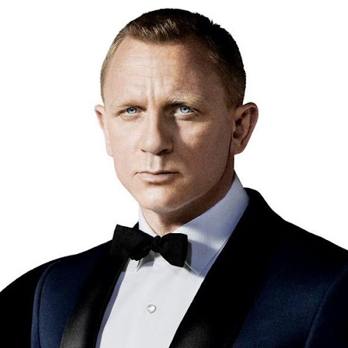

```{css, echo = FALSE}
.remark-slide-content {
  font-size: 18px;
  padding: 20px 80px 20px 80px;
}
.remark-code, .remark-inline-code {
  background: #f0f0f0;
}
.remark-code {
  font-size: 20px;
}
.huge .remark-code { /*Change made here*/
  font-size: 200% !important;
}
.tiny .remark-code { /*Change made here*/
  font-size: 75% !important;
}
```

# Overview

.large[
- Bond

- Stock

  - Valuation
  
  - Discounted Cash Flow (DCF)
  
  - Multiples
]

---

# Bond

.pull-left[
```{r, echo = F, out.width = "60%", fig.align="center"}
knitr::include_graphics("01-alphabet.PNG")
```

What are these terms?

- Cost of Financing
- Coupon
- Maturity

Most importantly, what are **BONDS**?
]
.pull-right[
> "NEW YORK (Reuters) - Alphabet Inc (GOOGL.O) borrowed $10 billion in the investment-grade corporate debt market on Monday, the Google parent’s largest ever bond issue, which it secured at its lowest-ever cost of financing.

> Of the $10 billion on offer, the $1 billion five-year tranche was issued at a coupon of 0.45%, the lowest coupon seen on a U.S. corporate bond at that maturity, according to Refinitiv data, which goes back to 1980."

> --- August 3rd, 2020

.small[https://www.reuters.com/article/us-alphabet-bonds/google-owner-alphabet-issues-record-10-billion-bond-at-lowest-ever-price-idUSKCN24Z2PC]
```{r, echo = F, out.width = "25%", fig.align="center"}

```
]
---

# Bond

.pull-left[.large[
**Bond** is a security sold by a government or a corporation to raise money from investors in exchange for a promised future payment.

<br><br>

Examples: T-Bills, T-Notes, T-Bonds, Commercial Paper, Corporate Bonds, Municipal Bonds, Mortgage-backed Securities, Asset-backed Securities, etc.
]]
.pull-right[
```{r, echo = F, out.width = "100%", fig.align="center"}
knitr::include_graphics("03-bond.jpg")
```
]
---

# Bonds: Terminology

.large[
Maturity (n): The final repayment date of a bond.

Coupon payment (**CPN**): The promised interest payments of a bond, paid periodically until maturity.

Face Value (**FV**) / Par value / Principal value: The notional amount of the bond used to compute the interest. The face value is typically repaid at maturity.

Yield to Maturity (**YTM**): The **YTM** is the Return on Investment (**ROI**) in a bond that is held to its maturity date. It is essentially the **IRR** taking considerations of the current market price of the bond and the future cash flows of the bond.

Coupon rate: The sum of all coupon payments in 1 year divided by the face value of the bond.
]

---

# Bond: Example

.large[
A bond with par value $1,000 with 8% coupon and semi-annual payments, maturing in 5 years.

This means that:
]

- $1,000 x 8% = $80 coupon payment per year.

- Since coupons are paid semi-annually, $80 / 2 = $40 will be paid every 6 months as coupon payments.

- $1,000 face value will be repaid at year 5.
```{r, echo = F, out.width = "80%", fig.align="center"}
knitr::include_graphics("04-couponbond.png")
```
---
class: left, middle

# Bond Price

.large[
How to Price bonds?

Treat it as a Time Value of Money (TVM) problem!
]
---

# Zero-Coupon Bond

.large[
A zero-coupon bond pays only the face value at maturity.

Recall the TVM formula:

$$
FV_t = PV\times(1+r)^t
$$
]

where FV<sub>t</sub> is future value at year t, PV is present value, r is interest rate.

Translating to "Bond language", a zero-coupon bond would have the following formula:
.pull-left[
$$
FV = P\times(1+YTM_n)^n\qquad \text{or}
$$
]
.pull-right[
$$
P = \frac{FV}{(1+YTM_n)^n}
$$
]

where FV is face value, P is price, YTM<sub>n</sub> is yield-to-maturity (as the effective rate per period), n is time to maturity (in terms of no. of compounding periods).

Note: n is the year to maturity and YTM<sub>n</sub> is the EAR only when the the interest is compounded annually.

---
# Zero-coupon Bond: Example

.large[
What is the market price of a zero-coupon bond with face value $50,000, 25 years to maturity, and 6% YTM?
]

---
# Zero-coupon Bond: Example

.large[
What is the market price of a zero-coupon bond with face value $50,000, 25 years to maturity, and 6% YTM?

Answer:

\begin{split}
P &= \frac{FV}{(1+YTM_n)^n}\\
&= \frac{50,000}{(1+0.06)^{25}}\\
&= \$11,655
\end{split}
]
---

# Coupon Bond

.large[
A coupon bond can be considered as 2 separate cash flows:

1. An annuity of coupon payments

2. A zero-coupon bond that repays the face value at maturity.

Combining these two cash flows, we get the formula for pricing a coupon bond:

$$
P = \frac{CPN}{YTM_n}\bigg[1 - \frac{1}{(1+YTM_n)^n}\bigg]+\frac{FV}{(1+YTM_n)^n}
$$
The first term is the annuity portion of the coupon, and the second term is the zero-coupon bond portion.
]

Note: You have to use YTM<sub>n</sub> and n corresponding to the coupon payment intervals. e.g. If coupon is paid<br>semi-annually, $n = \text{year-to-maturity}\times 2$, YTM<sub>n</sub> is the effective rate over 6 months.

---

# Coupon bond: Example

.large[
A bond with $1,000 par value, 5 years to maturity, 5% coupon rate paid semi-annually. If the bond has YTM of 6% (APR compounded semi-annually), what is the price of the bond?
]
---

# Coupon bond: Example

.large[
A bond with $1,000 par value, 5 years to maturity, 5% coupon rate paid semi-annually. If the bond has YTM of 6% (APR compounded semi-annually), what is the price of the bond?

$$
FV = \$1,000
$$
$$
CPN = \frac{5\% \times \$1,000}{2} = \$25 \quad\text{every 6 months}
$$
$$
n = 5 \times 2 = 10 \quad\text{semi-annual periods}
$$
$$
YTM_{10} = 6\%/2 = 3\% \quad \text{effective semi-annual rate}
$$
]
---

# Coupon bond: Example cont'd

.large[
Use the coupon bond formula:

\begin{split}
P &= \frac{CPN}{YTM_n}\bigg[1 - \frac{1}{(1+YTM_n)^n}\bigg]+\frac{FV}{(1+YTM_n)^n}\\
&= \frac{25}{0.03}\bigg[1 - \frac{1}{(1+0.03)^{10}}\bigg]+\frac{FV}{(1+0.03)^{10}}\\
&= \$957.35
\end{split}
]

---

# Solving for YTM

.large[
How to solve for YTM?

- For zero-coupon bonds, just solve it by rearranging the equation:

\begin{split}
&FV = P\times(1+YTM_n)^n\\
\Rightarrow \quad &YTM_n = \bigg(\frac{FV}{P}\bigg)^{\frac{1}{n}} - 1
\end{split}

- For coupon bonds, solve it the same way you solve for IRR:

$$
\frac{CPN}{YTM_n}\bigg[1 - \frac{1}{(1+YTM_n)^n}\bigg]+\frac{FV}{(1+YTM_n)^n} - P = 0
$$
]
Note: For coupon bonds, you might need to use tools such as excel to calculate the YTM<sub>n</sub>.

---
# Solving for YTM: Example

.large[
A coupon bond has a FV of $1,000, with 5 years to maturity. The coupon rate is 10% paid semi-annually. The current price of the bond is $859.52. What is the YTM (in terms of APR with semi-annual compounding)?
]

---
# Solving for YTM: Example

.large[
A coupon bond has a FV of $1,000, with 5 years to maturity. The coupon rate is 10% paid semi-annually. The current price of the bond is $859.52. What is the YTM (in terms of APR with semi-annual compounding)?

YTM:
\begin{equation}
\frac{1,000 \times 0.1 /2}{YTM_{10}}\times\bigg[1-\frac{1}{(1+YTM_{10})^{10}}\bigg]+\frac{1,000}{(1+YTM_{10})^{10}}-859.92 = 0
\end{equation}
$$
YTM_{10} = 7\%
$$
Convert to APR:

$$
YTM_{APR} = 7\% \times 2 = 14\%
$$
]

---

# Holding Period Return (HPR)
.large[
What if you sell a bond before it matures?

Consider the following example:

- You bought a coupon bond that matures sometime in the future. And after n years (before the bond matures), you decide to sell the bond at market price.

- Your cash flow consists of:
  - Buying the bond (initial investment, P<sub>0</sub>)
  - Coupon payments received while holding the bond. (CPN<sub>1</sub>, CPN<sub>2</sub>, ... , CPN<sub>n</sub>)
  - Selling price of the bond. (P<sub>n</sub>)

\begin{equation}
HPR = \frac{P_n - P_0 + \sum_{t=1}^n CPN_t}{P_0}
\end{equation}
]
---

# HPR: Example
.large[
- Suppose you buy a Government of Canada bond for $1,170.60.  The bond has a $1,000 face value, a 5% annual coupon and a 3% YTM and matures in 10 years.

- 2 years later, you sell the bond when the YTM was 2%. What is your holding period return?
]
```{r, echo = F, out.width = "55%", fig.align="center"}

```

---

# HPR: Example
.large[
First find the selling price of the bond at year 1:

We can consider this as a new bond that has FV of $1,000, **8** years to maturity, 5% annual coupon, and 2% YTM and calculate the fair price at year 2.

$$
P_2 = \frac{1,000 \times 0.05}{0.02}\times\bigg[1-\frac{1}{(1+0.02)^8}\bigg] + \frac{1,000}{(1+0.02)^8}= \$1,219.76
$$

The 2-year holding period return (HPR) is hence:

$$
HPR = \frac{P_2 - P_0 + CPN \times 2}{P_0} = 12.74\%
$$
]
---

# Bond Price vs YTM

.large[
Let's look at what can affect bond price:

Consider a coupon bond with FV $1,000, 5% Annual coupon, with 10 years to maturity, but various YTMs:
]
```{r, echo = F, out.width = "100%", fig.align="center"}
knitr::include_graphics("06-price_ytm.png")
```
---

# YTM and risks

.large[
- Bond prices decrease when YTM increases.

- Bond prices increase when YTM decreases.

<br><br>

What factors can affect YTM?

YTM reflects the **risks** of a bond:

Bonds with higher risk tend to have larger YTMs.
]

---

# Risk factors of bond

.large[
- Interest Rate Risk

  - The price of the bond changes due to future change in interest rate. As interest rate increases, bond price decreases.
  
- Credit Risk

  - Bonds could default. In that case, future coupon and principal payments are lost.
]

---

# Time to maturity vs Bond Price Risk

.large[
- Time to maturity

  - Bonds with longer time to maturity have greater price volatility than short bonds.
  
  - They are more prone to interest rate risk.
  
]

```{r, echo = F, out.width = "50%", fig.align="center"}

```

---

# Coupon size vs Bond Price Risk

.large[
- Size of Coupon

  - Low coupon bonds have greater price volatility than high coupon bonds
  
  - High coupons act as "stabilizing device", since they allows larger portion of the bond's total cash flow occur at earlier dates which are less susceptible to interest rate risk and credit risk.
  
]

```{r, echo = F, out.width = "40%", fig.align="center"}

```

---

# Bond: Summary
.large[
We learned:

- Definition of bonds and bond-related terminologies.

- How to value zero-coupon bonds

- How to value coupon bonds

- How to calculate YTM

- Holding period return (HPR)

- Bond risks

- Bond price volatility
]

---

# Breakout Activity: Bonds

.large[
- Work with your team

- Go to https://markets.businessinsider.com/bonds

- Use the Bond Finder to filter for corporate bonds.

- Pick your favorite company, pick a bond and calculate its YTM (in APR)

- Compare with other teams and discuss why your bonds have different YTM.
]

---

# Equities! (AKA Stocks)

