

# $1 in 1926 is now worth:

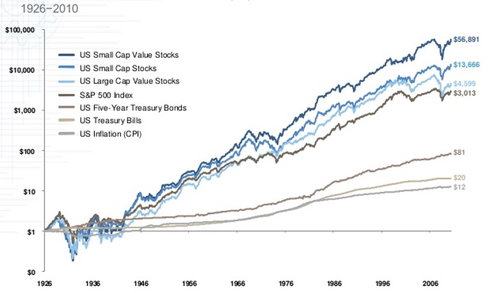

The return really depends on what you were investing in. But so does the risk...

---

# Overview
.large[
- Return of a Security

- Risk of a Security

- Risk and Return of a Portfolio

- Diversification
]

---
class: center, middle
# Return of a Security
---

# Holding Period Return (HPR)

.large[
Recall the formula for HPR:

\begin{equation}
HPR = \frac{P_n - P_0 + \sum_{t=1}^n \text{Income}_t}{P_0}
\end{equation}

Note: we changed CPN to Income so that the formula can be used for all securities, not just bonds.
  - For a stock, the income generated from stocks is in the form of dividend.
]

---

# HPR: Example

.large[
Assume 10 shares of stock "Get Rich Quick" were bought immediately after issuing a dividend and sold immediately after issuing a dividend one year later. The stock was bought for $22, sold for $27 and the dividend was $2. What was the holding period return?
]

---

# HPR: Example

.large[
Assume 10 shares of stock "Get Rich Quick" were bought immediately after issuing a dividend and sold immediately after issuing a dividend one year later. The stock was bought for $22, sold for $27 and the dividend was $2. What was the holding period return?
]

Answer:

For buying one share:

\begin{equation}
HPR = \frac{P_1 - P_0 + D_1}{P_0} = \frac{27-22+2}{22}=31.8\%
\end{equation}

For 10 shares:

\begin{equation}
HPR = \frac{P_1 - P_0 + D_1}{P_0} = \frac{270-220+20}{220}=31.8\%
\end{equation}

They are the same - return is a percentage and is not affected by the amount of initial investment.

---

# Historical Return

.large[
There are two ways of calculating the historical returns:

  - Arithmetic Average Return: 

\begin{equation}
  \bar{r} = \frac{1}{n} \sum_{t=1}^n r_t
\end{equation}
  
  - Geometric Average Return: 
  
\begin{equation}
  r_{geo} = \bigg[\prod_{t=1}^n(1+r_t)\bigg]^{\frac{1}{n}}-1
\end{equation}

]
---

# Historical Return: Example
.large[
You bought a stock at $100 in year 0. The returns are 5%, -10%, +15% in the next 3 years. 

What is the arithmetic average return? 

What is the geometric average return?
]
---

# Historical Return: Example
.large[
You bought a stock at $100 in year 0. The returns are +10%, -30%, +25% in the next 3 years. 

What is the arithmetic average return? 

What is the geometric average return?
]

Answer:

\begin{equation}
  \bar{r} = \frac{10\%-30\%+25\%}{3} = 1.67\%
\end{equation}

The arithmetic average return is 1.67%

\begin{equation}
  r_{geo} = \bigg[(1+0.1)\times(1-0.3)\times(1+0.25)\bigg]^{\frac{1}{3}} -1 = -1.27\%
\end{equation}

The geometric average return is -1.27%

---

# Historical Return: Discussion
.large[
- The arithmetic return is the return assuming you invest the same amount every year.

- The geometric return is the return assuming you make the invest at the beginning and hold until the end date.

- The geometric average return is always lower than the arithmetic average return.

Which one to use?

- Use geometric return when calculating historical return of holding an investment over a period of time. (e.g. $1 of investment from 1926 to 2020.)

- Use arithmetic return when estimating the expected return of securities for a year. (e.g. What is the expected return of a random year?)
]

---

class: center, middle
# Return of a Security
---

# Risk
.large[
Different asset types have different risks:

- Cash equivalents
  - Debt securities that are very liquid, very low-risk and very short-term (e.g. T-bills)
  
- Bonds
  - Debt instruments that have a longer maturity than cash (e.g. Long term bonds)

- Stocks
  - Ownership of shares in publicly held corporations (e.g. Firms listed on TSX or NYSE)
]

---
# Risk

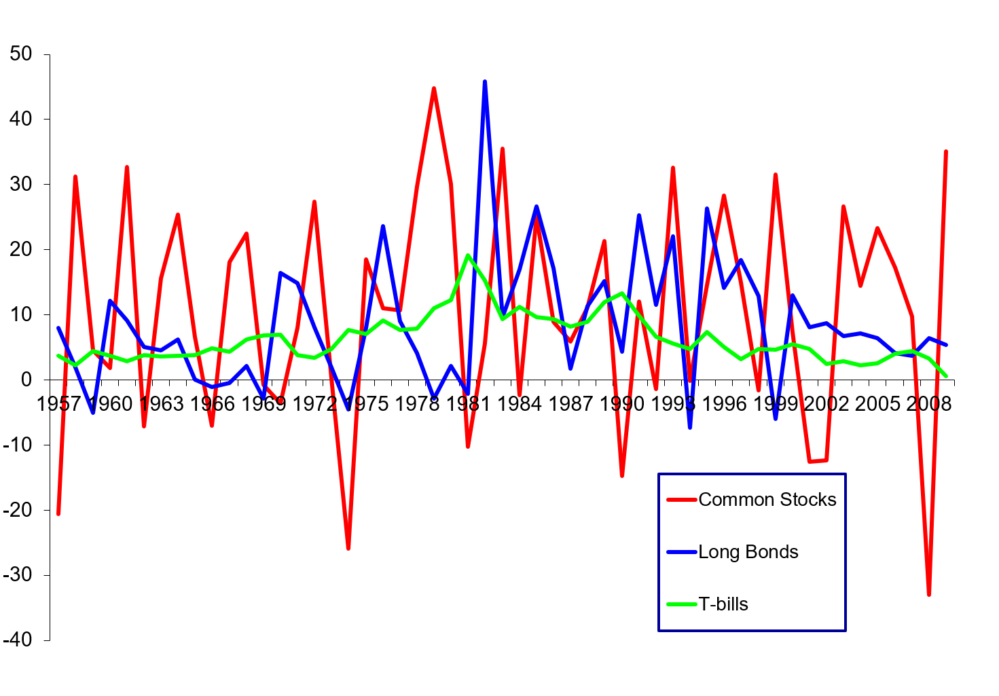
.center[Rates of Return (1957 - 2009)]

---

# Risk
.large[
- The spread of a return distribution is a measure of how much an observed return may deviate from its mean value.

- We usually use the standard deviation (σ) to represent the spread of a normal distribution, often referred to as its “risk”.

  - Standard deviation is the square root of variance.
]
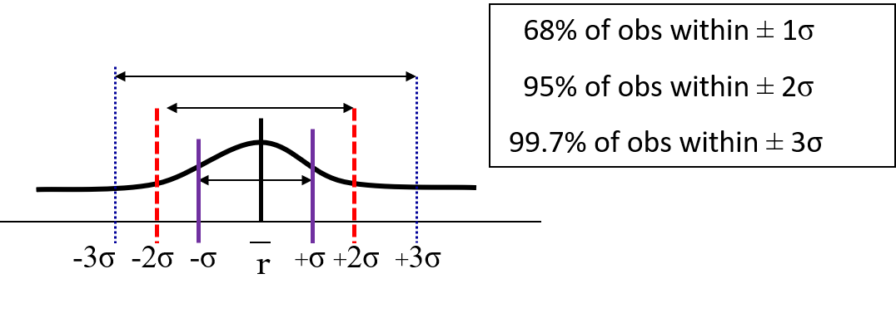

---

# Risk

## Computing Variance and Standard Deviation

.large[
\begin{equation}
  \sigma^2 = \frac{\sum_{t=1}^n(r_t -\bar{r})^2}{n-1}
\end{equation}
]

.large[
Note: *σ* is the **standard deviation** of the return. It can be computed by taking the square root of the variance *σ2*.
]

---

# Risk: Example
.large[
Calculate the average return for Berkshire Hathaway (BRK.B) shares and their standard deviation  from data in the following table. No dividends were paid.
]

|Date        |  Price|
|:-----------|------:|
|Dec 31 2013 | 118.56|
|Dec 31 2014 | 150.15|
|Dec 31 2015 | 132.04|
|Dec 31 2016 | 162.98|
|Dec 31 2017 | 198.22|
|Dec 31 2018 | 204.18|
.large[
What are the variance and standard deviation of the returns?
]

Note: If dividends were paid you would need to include them when calculating the annual returns.

---

# Risk: Example

.large[
Answer:
]

|Date        |  Price| Annual_Return| Return_Diff| Return_Diff_Sq|
|:-----------|------:|-------------:|-----------:|--------------:|
|Dec 31 2013 | 118.56|            NA|          NA|             NA|
|Dec 31 2014 | 150.15|     0.2664474|   0.1411578|      0.0199255|
|Dec 31 2015 | 132.04|    -0.1206127|  -0.2459023|      0.0604680|
|Dec 31 2016 | 162.98|     0.2343229|   0.1090333|      0.0118883|
|Dec 31 2017 | 198.22|     0.2162228|   0.0909332|      0.0082689|
|Dec 31 2018 | 204.18|     0.0300676|  -0.0952220|      0.0090672|

$$
\sigma^2 = \frac{0.0199 + 0.0605 +0.0119+ 0.0083 + 0.0091}{5-1}=0.0274045
$$

$$
\sigma = 16.55\%
$$
---

# Risk Premium
.large[
- Risk Premium = Return – rf 
  - Excess return above the risk-free rate which stems from holding risky assets rather than risk-free ones (e.g. T-bills)

- A key empirical observation from stock & bond data is the existence of long-run excess returns:

  - Average excess return (risk-premium) to Canadian common stocks between 1957 and 2016 was: **4.33%** = 10.3% –5.97%

  - Average excess return (risk premium) to Canadian long-term bonds between 1957 and 2016 was: **2.19%** = 8.16% – 5.97%
]

---

# Equity Market Risk Premium
.large[
The **Equity Market Risk Premium** is the additional return (over and above the risk-free rate) resulting from bearing risk.
]

.large[
- The lower the Equity Market Risk Premium, the lower the discount rate.

- The lower the discount rate, the higher the valuation! 
]

---

# Expected Return and Risk of a Security

.large[Expected Return:

\begin{equation}
E(R) = \sum_{i=1}^N R_iPr(i)
\end{equation}

\begin{equation}
\sigma^2 = \sum_{i=1}^N \bigg[\big(R_i - E(R)\big)^2 Pr(i)\bigg]
\end{equation}

]

Where: 
*E(R)* = Expected Return  
*N* = Number of possible states  
*Ri* = Return when in state *i*  
*Pr(i)* = Probability of state *i* happening.

---

# Expected Return and Risk: Example
.large[
Return estimates for Company Corp.
Bust: r = 10% with probability 0.20
Normal: r = 15% with probability 0.50
Boom: r = 20% with probability 0.30
Compute the expected return and standard deviation for Company Corp.
]

---

# Expected Return and Risk: Example
.large[
Return estimates for Company Corp.
Bust: r = 10% with probability 0.20
Normal: r = 15% with probability 0.50
Boom: r = 20% with probability 0.30
Compute the expected return and standard deviation for Company Corp.
]

Answer:

$$
E(R) = (0.1\times 0.2) + (0.15\times 0.5) + (0.2\times 0.3)= 15.5\%
$$

$$
\sigma^2 = (0.2\times (0.1 - 0.155)^2)+(0.5 \times (0.15-0.155)^2) + (0.3\times (0.2-0.155)^2) = 0.001225
$$

$$
\sigma = \sqrt{0.001225} = 0.035 = 3.5\%
$$

---

# Breakout Activity: Historical return
.large[Go to [Yahoo! Finance](https://finance.yahoo.com/)] .small[Maybe the only thing Yahoo is doing better than Google.]

.large[
Pick a stock with > 10 years available historical prices.

Compute the average (arithmetic and geometric) monthly return.

Compute the standard deviation of the historical return.

Report to the class about your findings.
]
---

class: center, middle

# Risk and Return of a Portfolio

---
 
# Portfolio Expected Return (*Rp*)
.large[
A portfolio’s expected return *Rp* is a **weighted average** of the individual assets’ expected returns.

\begin{equation}
E(R_p) = \sum_{i=1}^N W_iE(R_i)
\end{equation}

]

Where:

- *Wi*: Weight of the ith asset in the portfolio.

  - Note: $\sum_{i=1}^N W_i = 1$

- *E(Ri)*: Expected return of the ith asset in the portfolio.

- *N*: Total number of assets in the portfolio

---

# Portfolio Expected Return: Example
.large[
Calculate the *expected annual return* of the following portfolio:
]

|Stock |Invested_Amount |Expected_Annual_Return |
|:-----|:---------------|:----------------------|
|A     |$100            |10%                    |
|B     |$300            |20%                    |

---

# Portfolio Expected Return: Example
.large[
Calculate the *expected annual return* of the following portfolio:
]

|Stock |Invested_Amount |Expected_Annual_Return |
|:-----|:---------------|:----------------------|
|A     |$100            |10%                    |
|B     |$300            |20%                    |

Answer:

.large[
$$
W_A = \frac{100}{100+300} = 25\% \qquad W_B = \frac{300}{100+300} = 75\%
$$

\begin{split}
E(R_p) &= W_AE(R_A) + W_BE(R_B)\\
&=(0.25 \times 0.1) + (0.75 \times 0.2) = 17.5\%
\end{split}

The expected annual return of the portfolio is 17.5%.
]

---

# Portfolio Variance
.large[
The variance of a portfolio is slightly more complicated to compute:

For a portfolio with 2 assets, A and B:

$$
\sigma_P^2 = W_A^2\sigma_A^2 + W_B^2\sigma_B^2 + 2W_AW_Bcov(R_A,R_B)
$$
Where: 
- *σp2* is the variance of the portfolio. 
- *WA*, *WB* are weights of asset A and B. 
- *σA2*, *σB2* are variance of returns of asset A and B. 
- *cov(RA, RB)* is the **covariance** betweens the returns of asset A and B.

How to calculate covariance?
]

---

# Covariance
.large[
**Covariance** is a way to measure whether two random variables are related, and how.

- Positive when returns of two assets tend to move in the same direction, and vice versa.

For two assets A and B:

\begin{equation}
\text{Covariance} (cov(R_A,R_B)) = \sum_{i=1}^N Pr(i)(R_{A,i} - E(R_A))(R_{B,i} - E(R_B))
\end{equation}

]

Where: 
- *N* is the total number of possible states. 
- *Pr(i)* is the probability of state *i*. 
- *RA, i* and *RB, i* are the returns of asset A and B at state *i*. 
- *E(RA)* and *E(RB)* are the expected returns of asset A and B.

---

# Correlation
.large[
**Correlation** normalizes covariance so that the parameter is bounded between -1 and +1.

\begin{equation}
\text{Correlation} (corr(R_A,R_B)) = \rho_{A,B} = \frac{Cov(R_A,R_B)}{\sigma_A\sigma_B}
\end{equation}

- A correlation of -1 means that the two asset prices move at completely opposite directions.

- A correlation of +1 means that the two asset prices move together in the same direction.

- A correlation of 0 means that the two asset price movements are unrelated.
]
---

# Correlation: Graphs

.pull-left[

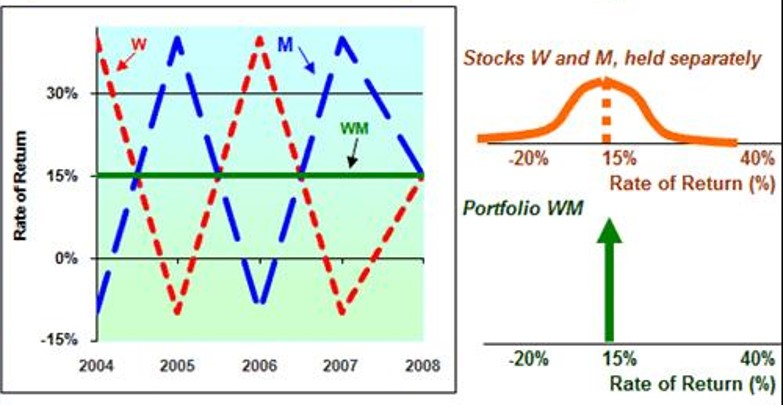

Correlation = -1

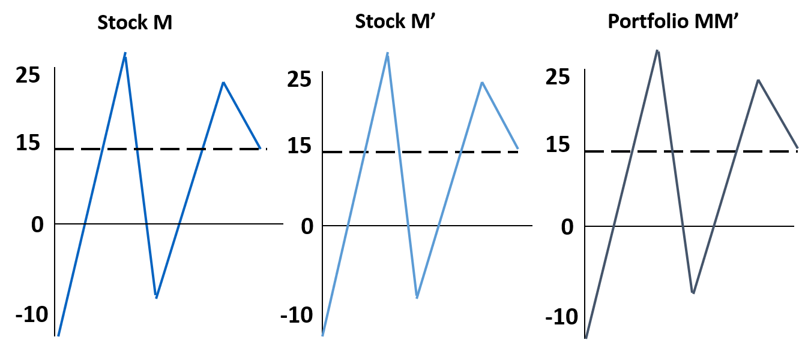

Correlation = +1

]
.pull-right[

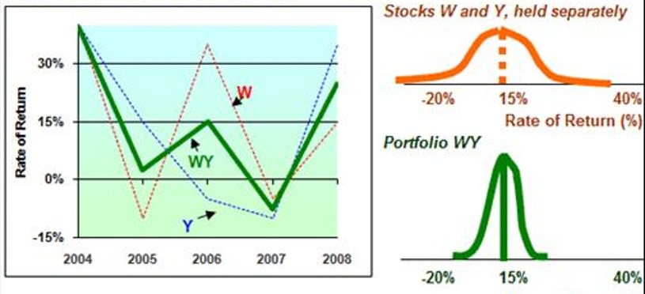

Correlation = 0.35

]

---

# Portfolio Risk: Example

|State     |Probability |Return_A |Return_B |
|:---------|:-----------|:--------|:--------|
|Recession |30%         |0%       |-5%      |
|Normal    |40%         |10%      |20%      |
|Boom      |30%         |20%      |35%      |
.large[
What is the correlation of A and B?

What is the variance and the standard deviation of a portfolio consisting of 25% A and 75% B?
]

---

# Portfolio Risk: Example

|State     |Probability |Return_A |Return_B |
|:---------|:-----------|:--------|:--------|
|Recession |30%         |0%       |-5%      |
|Normal    |40%         |10%      |20%      |
|Boom      |30%         |20%      |35%      |

.large[Find the expected returns and risks of asset A and B:]

$$
E(R_A) = 0.3\times 0\% + 0.4 \times 10\% + 0.3 \times 20\% = 10\%
$$

$$
E(R_B) = 0.3 \times (-5\%) + 0.4 \times 20\% + 0.3 \times 35\% = 17\% 
$$

$$
\sigma_A = \sqrt{0.3\times (0-10\%)^2 + 0.4\times(10\%-10\%)^2 + 0.3\times(20\%-10\%)^2} = 7.75\%
$$

$$
\sigma_B = \sqrt{0.3\times (-5\%-17\%)^2 + 0.4\times(20\%-17\%)^2 + 0.3\times (35\%-17\%)^2} = 15.68\%
$$
---

# Portfolio Risk: Example

|State     |Probability |Return_A |Return_B |
|:---------|:-----------|:--------|:--------|
|Recession |30%         |0%       |-5%      |
|Normal    |40%         |10%      |20%      |
|Boom      |30%         |20%      |35%      |
.large[Find covariance and correlation between returns of asset A and B:]

\begin{split}
Cov(R_A,R_B) &= \sum_{i=1}^N Pr(i)(R_{A,i} - E(R_A))(R_{B,i}-E(R_B))\\
&= 0.3\times (0-10\%)\times (-5\%-17\%) + 0.4\times(10\%-10\%)\times (20\%-17\%)\\
&\qquad \qquad \qquad + 0.3\times (20\%-10\%) \times (35\% - 17\%)\\
&= 0.012
\end{split}

\begin{split}
\text{Correlation}(\rho_{A,B}) = \frac{Corr(R_A,R_B)}{\sigma_A\sigma_B} = \frac{0.012}{0.0775\times 0.1568} = 0.9872
\end{split}

The correlation between returns of asset A and B is 0.9872.

---

# Portfolio Risk: Example

|State     |Probability |Return_A |Return_B |
|:---------|:-----------|:--------|:--------|
|Recession |30%         |0%       |-5%      |
|Normal    |40%         |10%      |20%      |
|Boom      |30%         |20%      |35%      |
.large[Find the variance and standard deviation of a portfolio containing 25% A and 75% B:]

\begin{split}
\sigma_P^2 &= W_A^2\sigma_A^2 + W_B^2\sigma_B^2 + 2W_AW_BCov(R_A,R_B)\\
&= 0.25^2\times 0.0775^2 + 0.75^2 \times 0.1568^2 + 2\times 0.25\times 0.75\times 0.012\\
&= 0.0187
\end{split}

The variance of the portfolio is 0.0187.

$$
\sigma_p = \sqrt{\sigma_p^2} = \sqrt{0.0187} = 13.68\%
$$

The standard deviation of the portfolio is 13.68%.

---
# Diversification

---
# Diversification
.pull-left[.large[
Consider a 2 asset portfolio, with assets A and B:

- *E(RA) = 8%* , and *σA = 9%*

- *E(RB) = 13%*, and *σB = 20%*

- *Cov(RA, RB) = 0.0054*, *ρA, B = 0.3*

What happens to the portfolio risk and return as we change the weights of A and B? Lets graph this.
]]
.pull-right[
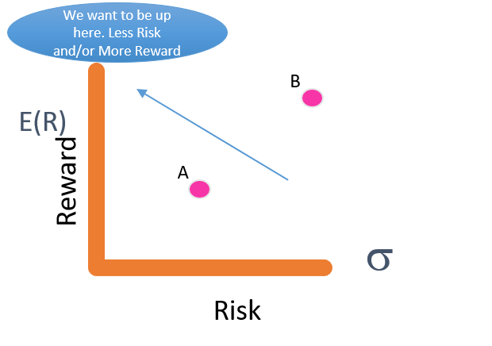
]

---
# Diversification
.pull-left[

]
.pull-right[
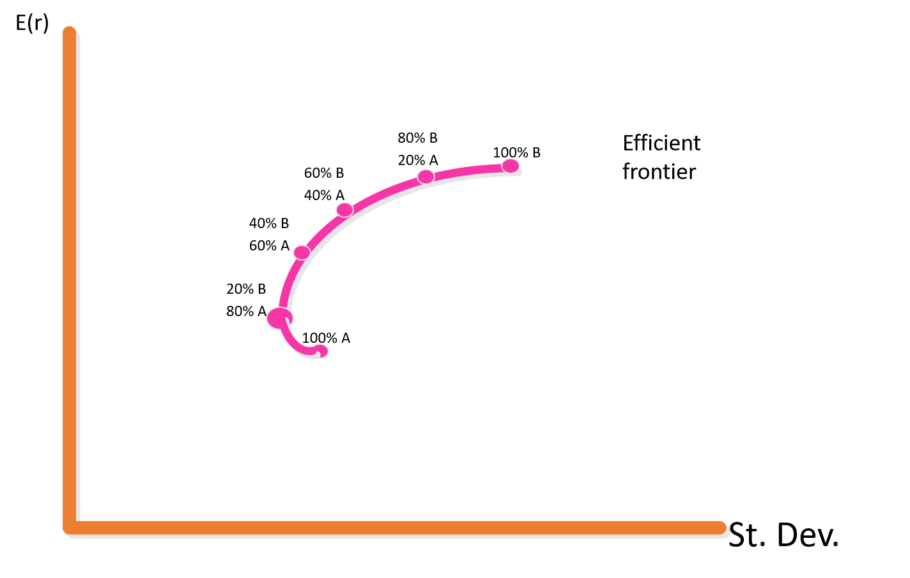
]

---
# Diversification: Effects

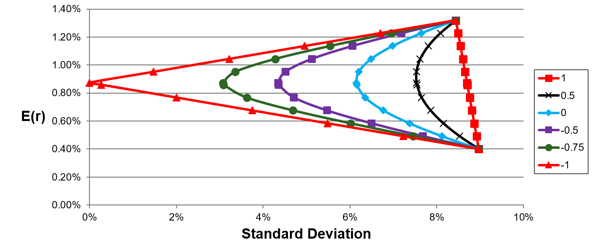

- The standard deviation of a portfolio is **less than** the weighted average of the individual (asset) standard deviations as long as the assets’ returns are imperfectly correlated. (i.e. $\rho <1$ )

- Diversification can substantially reduce the variability of returns without an equivalent reduction in expected returns.

- This risk reduction arises because worse than expected returns from one asset are offset by better than expected returns from another asset. *(Think about owning an Umbrella and Sunglass firms)*

---

# Extension to > 2 Securities

.pull-left2[

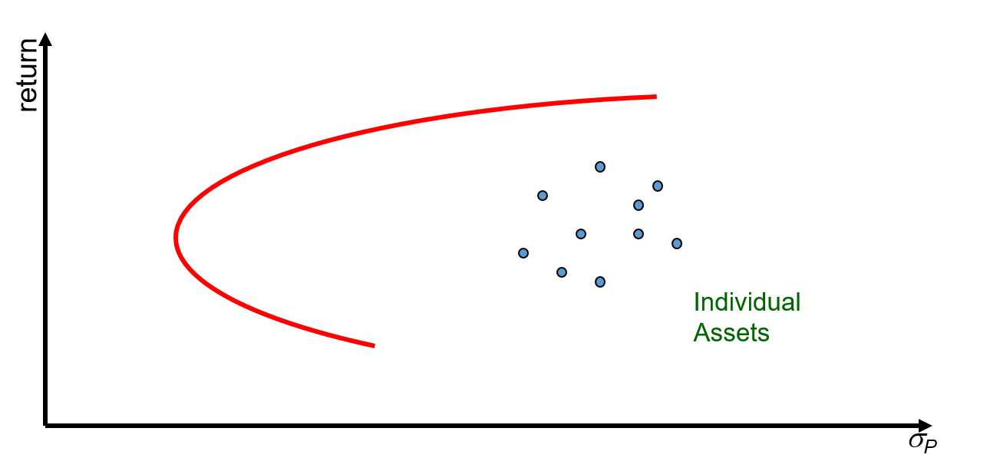

Consider a world with many risky assets; we can still identify the opportunity set of risk-return combinations of various portfolios

]
.pull-right2[

Father of Modern Portfolio Theory (and Nobel Laureate) Harry Markowitz

]
---

# Extension to > 2 Securities
.pull-left[
Portfolio Optimization Step by Step:

1. Define the feasible set of investments.

2. Locate the minimum variance portfolio.

3. Derive the efficient set. The risk return characteristics of efficient portfolios dominate inefficient portfolios.

4. Choose location on efficient portfolio depending on risk preferences.
]
.pull-right[

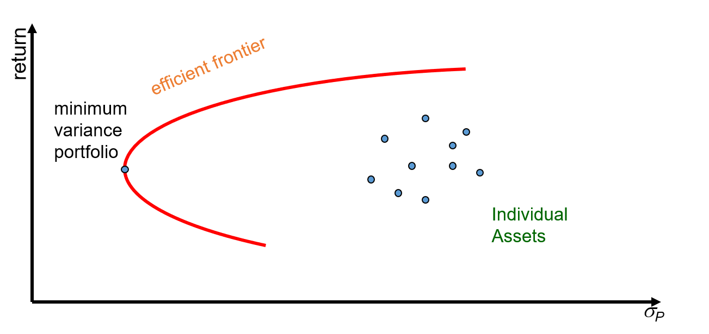

The section of the opportunity set above the minimum variance portfolio is the efficient frontier

]

---
# Risk: A Breakdown
.large[
- Variance (risk) of an asset’s return can be decomposed
  - **Systematic (Market) Risk**
      - Economy-wide random events that affect almost all assets to some degree
  - **Idiosyncratic (diversifiable) Risk** 
      - Risks that is caused by a single security or small groups of securities (e.g. specific industry, country, etc.)

- Diversification Effects
  - **Idiosyncratic risk** is significantly reduced in “large” portfolios
  - **Systematic risk** is not affected by diversification because (almost) all securities in the portfolio are affected by macro-events.
]

---
# International Diversification
.large[
Historically, correlations between countries’ stock exchanges have been low.
- Markets have been relatively “segmented”
]
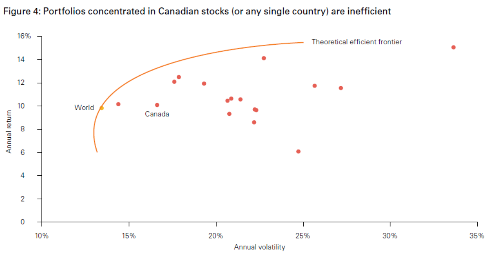

---

# International Diversification

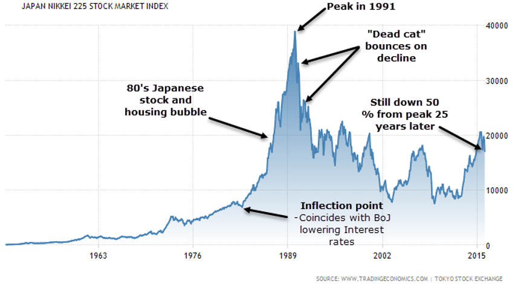

.large[
Moral of the Story:  
Avoid “Home Bias”. Diversifying across country factors has been more  important than across industry factors. (Especially if you are Japanese.)
]

---

# Asset Class Diversification

.pull-left[.large[
- Combining equity portfolios with Bonds and Commodities have also provided great diversification benefits.

- Notice that correlations have been time varying.
]]
.pull-right[
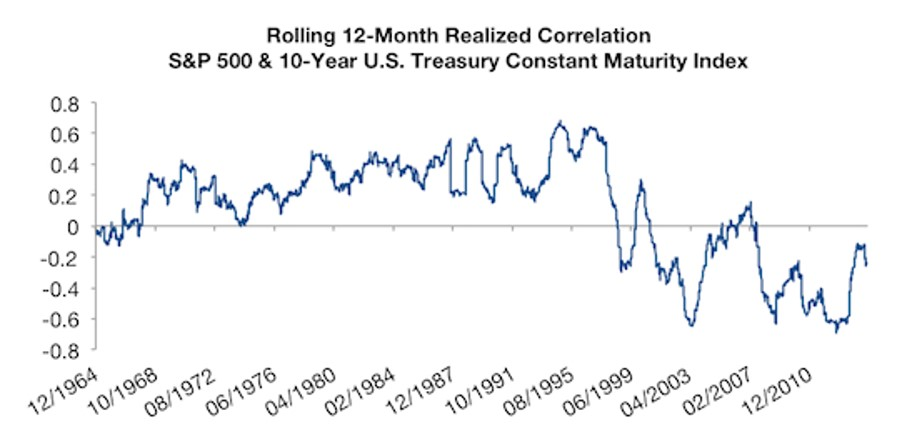

]

---

# Diversification: Considerations
.large[
- Some risks look big and dangerous but really are diversifiable.

- Market risks are macro risks and cannot be completely diversified. (can diversify some through across asset class investments, i.e. bonds and commodities)

- Always diversify. Some risks can be measured, but the big risks we don’t see coming, and diversification (both within asset class, across asset class, and across country) will never hurt you.

- ALWAYS DIVERSIFY, it’s the only “free lunch” out there.
]

---

# In Summary
.large[
We learned:

- How to calcualte historical returns.

- How to calculate expected return, variance and standard deviation of a stock, or a portfolio of stocks.

- How to calculate the covariance and correlation between two asset returns.

- How to diversify a portfolio and its risk-reducing effects.
]

---

# Breakout Activity: Minimum Variance Portfolio
.large[
Go to [Yahoo! Finance](https://finance.yahoo.com/)

Pick two stocks.

Compute the expected return, standard deviation of both stocks. (Based on monthly return)

Compute the covariance between the 2 stock returns.

Generate a table of possible portfolios and calculate the portfolio expected return and standard deviation.

Plot the results, find the weights that make up the minimum variance portfolio.

Report the results to the class.
]

---

# Formula Sheet

\begin{equation}
HPR = \frac{P_n - P_0 + \sum_{t=1}^n \text{Income}_t}{P_0}
\end{equation}

\begin{equation}
  \bar{r} = \frac{1}{n} \sum_{t=1}^n r_t
\end{equation}
  
\begin{equation}
  r_{geo} = \bigg[\prod_{t=1}^n(1+r_t)\bigg]^{\frac{1}{n}}-1
\end{equation}

\begin{equation}
  \sigma^2 = \frac{\sum_{t=1}^n(r_t -\bar{r})^2}{n-1}
\end{equation}

---

# Formula Sheet cont'd

\begin{equation}
E(R) = \sum_{i=1}^N R_iPr(i)
\end{equation}

\begin{equation}
\sigma^2 = \sum_{i=1}^N \bigg[\big(R_i - E(R)\big)^2 Pr(i)\bigg]
\end{equation}

\begin{equation}
E(R_p) = \sum_{i=1}^N W_iE(R_i)
\end{equation}

$$
\sigma_P^2 = W_A^2\sigma_A^2 + W_B^2\sigma_B^2 + 2W_AW_Bcov(R_A,R_B)
$$

\begin{equation}
cov(R_A,R_B) = \sum_{i=1}^N Pr(i)(R_{A,i} - E(R_A))(R_{B,i} - E(R_B))
\end{equation}

\begin{equation}
corr(R_A,R_B) = \rho_{A,B} = \frac{Cov(R_A,R_B)}{\sigma_A\sigma_B}
\end{equation}
