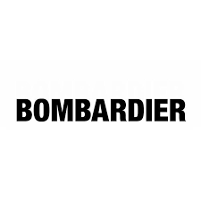

```{css, echo = FALSE}
.remark-slide-content {
  font-size: 18px;
  padding: 20px 80px 20px 80px;
}
.remark-code, .remark-inline-code {
  background: #f0f0f0;
}
.remark-code {
  font-size: 20px;
}
.huge .remark-code { /*Change made here*/
  font-size: 200% !important;
}
.tiny .remark-code { /*Change made here*/
  font-size: 75% !important;
}
```

# Intro to Bombardier Case

.pull-left[.large[
- Bombardier is exploring the potential of a new project, the C Series.

- They have determined that consumers are willing to pay more for their C Series.

- Is this project profitable? Will it break even?
]]
.pull-right[
```{r, echo = F, out.width = "100%", fig.align="center"}

```
]
---

# Case Objective

.large[
- The case requires you to calculate the projects IRR and NPV from the projections on revenue

- This will require you to understand capital budgeting quite well
  - Calculating operating cash flow and investment cash flows will give you what you need
  - Don’t forget to account for depreciation and taxes
  - Remember that variable costs grow by a percentage each year
  
- Submit your calculations using excel sheets
]
---
# Case Discussion

.large[
Please spend a few minutes with your team to discuss the case.

Some questions to consider:

- What are the revenue, expenses, CAPEX of the project?

- Are there any sunk costs?

- How to calculate the depreciation of the machinery?
]
