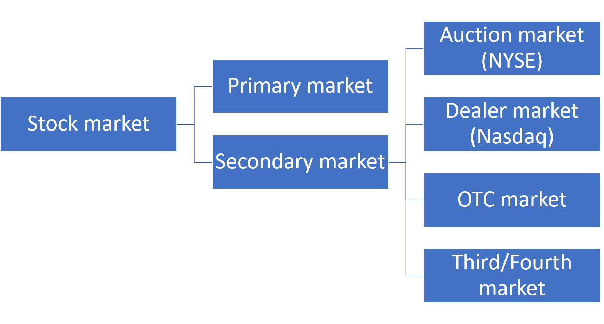
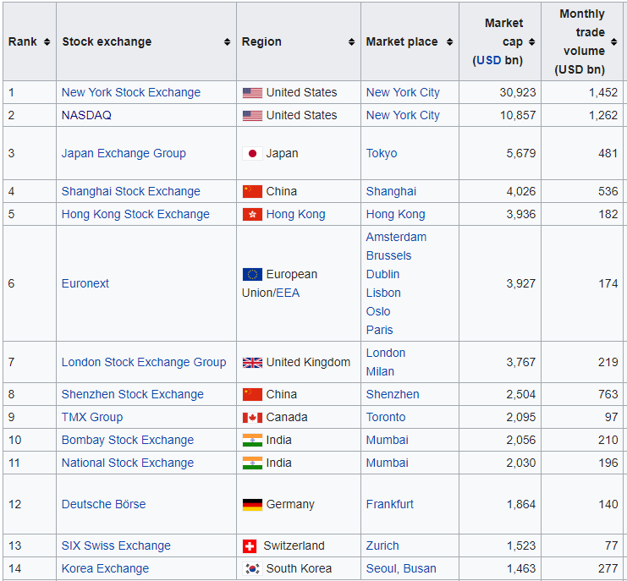
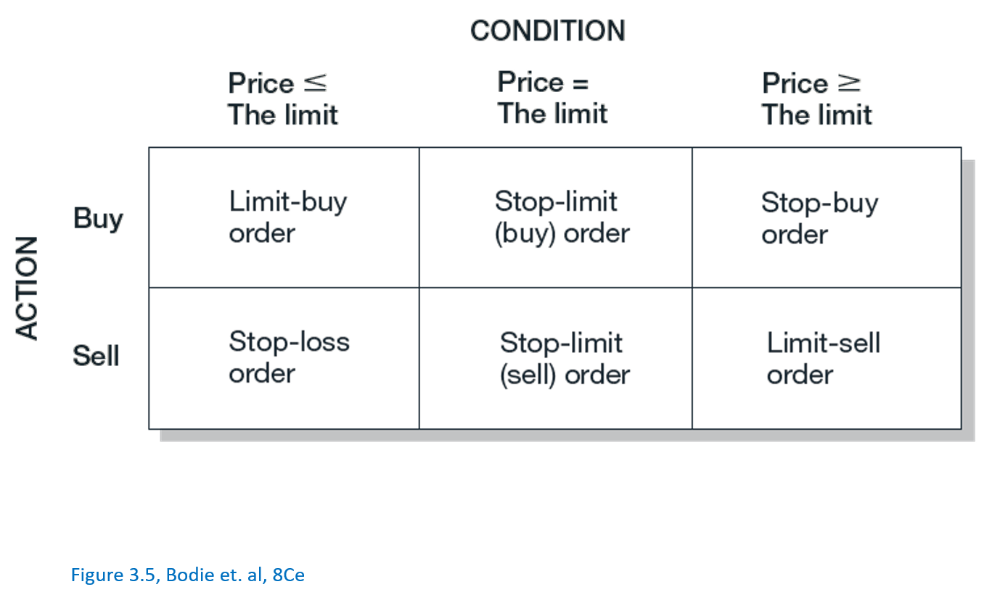
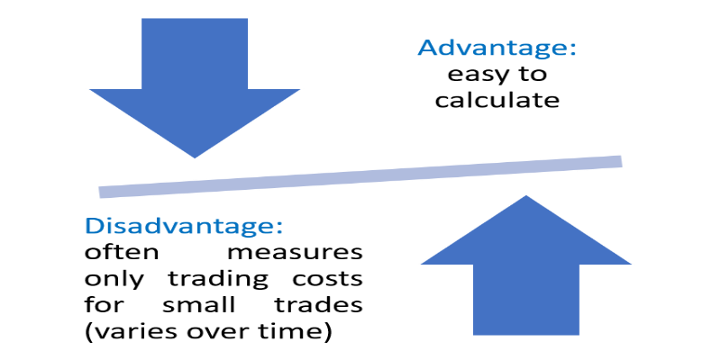
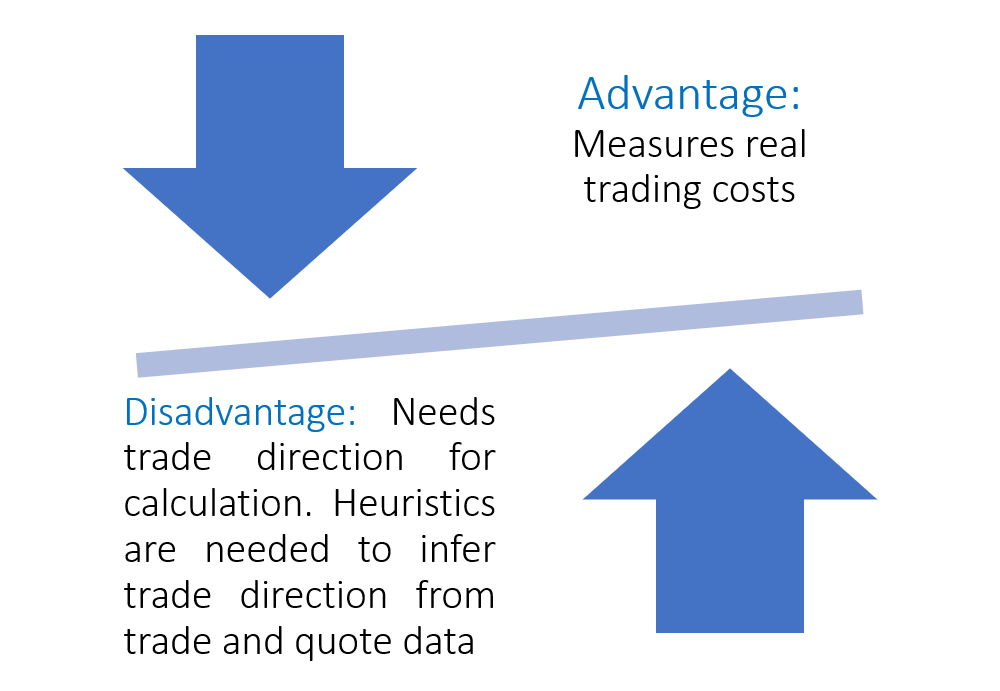
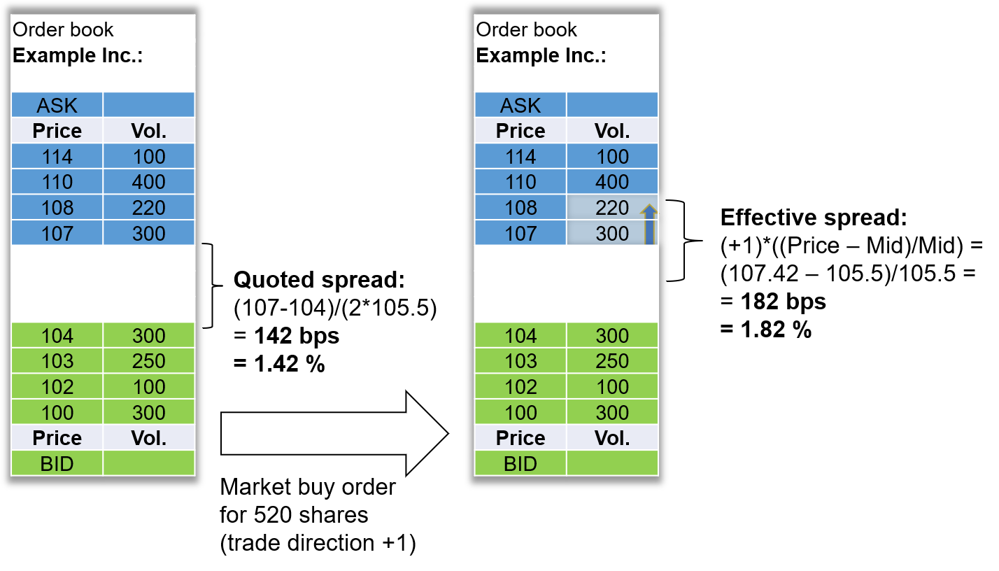
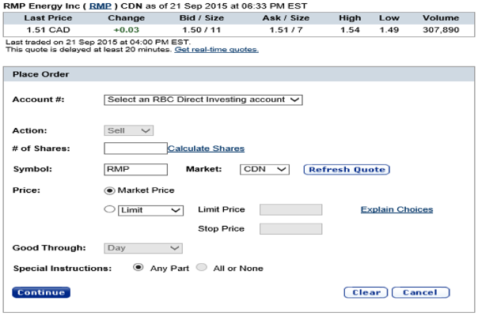
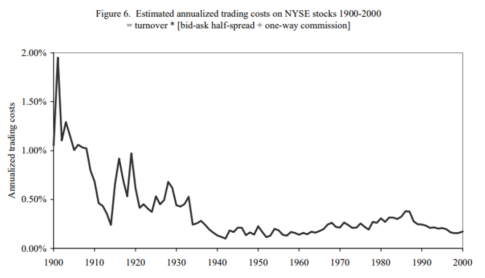
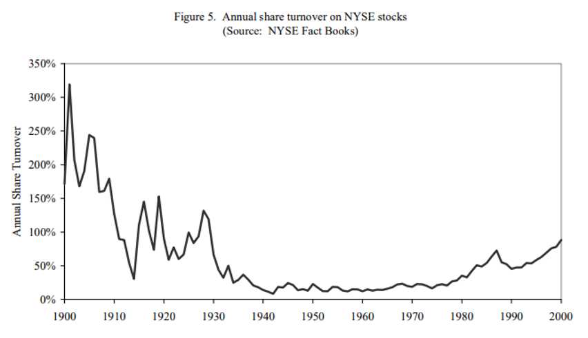
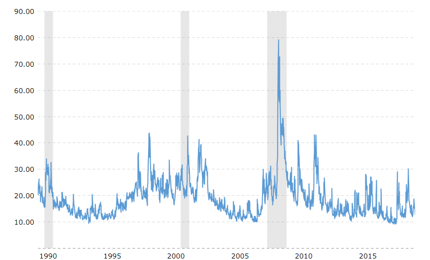

```{css, echo = FALSE}
.remark-slide-content {
  font-size: 18px;
  padding: 20px 80px 20px 80px;
}
.remark-code, .remark-inline-code {
  background: #f0f0f0;
}
.remark-code {
  font-size: 20px;
}
.huge .remark-code { /*Change made here*/
  font-size: 200% !important;
}
.tiny .remark-code { /*Change made here*/
  font-size: 75% !important;
}
```

Agenda
================================

.large[
- Market types


- Order types


- Cost of Trading


- Assessing market quality
]


---
class: left, middle

# What gets traded?

---
class: left

# What gets traded?

- .large[Securities:]

--

  - Stocks 
  
--
  
  - Bonds 
  
--
  
  - Options 
  
--
  
  - Futures
  
--
  
  - Rates
  
--
  
  - Currency
  
--
  
  - ...
  
---
class: left, middle

# Market types

---
# Market types
.pull-left[.border2[
 .large[.center[.white[By items trade]]]
 
 
  - .med[.white[Stock market]]
  
  
  - .med[.white[Bond market]]   
  
  
  - .med[.white[Commodity market]]   
  
  
  - .med[.white[Foreign exchange market]]
]]

.pull-right[.border2[
 .large[.center[.white[By security type]]]
 
 
 - .med[.white[Spot market]]   
 
 
 - .med[.white[Derivative/future market]]
 
 
 <br>
 <br> 
 <br> 
]]


???
Different ways of categorizing markets.

Today we will focus on the stock market mostly.


---



---


Primary market
===================

- .large[A market where securities/stocks are created by the firm and sold to investors.]


- .large[Examples:]
  - IPO (Initial public offering)
  - Rights offering
  - Private placement
  - Preferential allotment

???
Rights offering: firms that are already in the secondary market raising additional capital by issuing more shares and current shareholders have the rights to purchase such shares first.

Private placement: Directly issue and sell shares to a private entities such as hedge funds or banks.

Preferential allotment: Offering shares to investors (hedge funds, banks again) at an exclusive discounted price which is not available to the public.

---

Secondary Market
===================
- .large[A market where shareholders/investors trade with each other on the outstanding shares of firms.]


- .large[Types of secondary market depends on the trading mechanism]
  - Auction market/Organized exchange: Everyone get together and declare their price and trade accordingly.
  - Dealer market: Dealers have inventory of stocks and trade to both buyers and sellers and earn profit through the spread.
  - OTC, third and fourth markets

---

Auction market / Organized exchange
===================
- .large[NYSE]
- .large[Specialists: Focusing on one or several stocks, and maintain a book of all unexecuted orders and decide the bid-ask prices.]
  - .med[Act as both broker and dealer]
      - Broker: execute the buy/sell order on behalf of clients
      - Dealer: trade on their own account and inventories
  - .med[Specialist can reduce the bid-ask spread in their discretion.]
      - Example:
          - highest unexecuted bid: $10
          - Lowest unexecuted ask: $12
          - A specialist can offer bid at $11 and ask at $11.05 such that the spread is reduced to a more reasonable level.


---


Dealer market
===================
- .large[Nasdaq]


- .large[No specialist but dealers/market makers exist to provide liquidity]


- .large[Difference between dealer and auction market]
  - .med[No central location needed]
  - .med[Negotiated market]
  - .med[Can have more than 1 dealer per stock]

---

.exl[Over-the-counter markets]
- .large[Used to mean the same thing as dealer market]
- .large[Now primarily used to refer to stocks that are not listed on NYSE, Nasdaq and AMEX, e.g. OTCBB, OTC Markets Group.]

.exl[Third market]
- .large[OTC transaction on listed stocks]

.exl[Fourth market]
- .large[Large institutions trading directly without brokers]

---
.little[Top stock exchange by market capitalization]
=====================================================
.pull-left1[
 As of 30 Nov 2018
]

.pull-right1[

]

???
https://en.wikipedia.org/wiki/List_of_stock_exchanges

---


class: left, middle

# Type of Orders

---

Types of Orders
======================

.pull-left[

  .pull-left[.border3[.center[
    Market Order
  ]]
      <br><br>-Will execute instantaneously at whatever the best available price is.
      <br><br>
      -Guarantees that the order will be executed, but does not guarantee the execution price.
  ]
  .pull-right[.border4[.center[
    Price Contingent
  ]]
      <br><br>-"Limit order"
      <br><br>
      -Will only execute if it matches an existing order, otherwise added to the book.
      <br><br><br><br>
  ]
]

.pull-right[

  .pull-left[.border5[.center[
    Stop
  ]]
      <br><br>-(-loss, -buy, limit)
      <br><br>
      -Will execute once the price reaches the specific price (known as the 'stop price').
      <br><br><br><br>
  ]
  .pull-right[.border6[.center[
    Time Expiry
  ]]
      <br><br>-Time limit on the execution of the order.
      <br><br><br><br><br><br><br><br>
  ]
]

---

Limit Order Markets
=====================

- Limit order markets provide two basic order types
  - .blue[Market orders:] "A market order is an instruction to trade at the best price currently available in the market"(Harris 2003, p. 71)
  - .blue[Limit orders:] "A limit order is an instruction to trade at the best price available, but only if it is no worse than the limit price specified by the trader" (Harris 2003, p. 73)


- Terms:
  - .blue[Bid:] bid price is the price at which a trader is willing to buy securities
  - .blue[Best bid:] best bid is the highest bid price in a market
  - .blue[Ask:] ask price is the price at which a trader is willing to sell securities
  - .blue[Best ask:] best ask is the lowest ask price in a market

---
Order Book Example
==============
.pull-left[
```{r, echo = F, message = F}
library(orderbook)
ob <- orderbook(file = "./sample.txt")
ob <- read.orders(ob,10000)
display(ob)
```
]
---
Orderbook Example Continued
==============
.center[
```{r, echo = F}
plot(ob)
```
]
---
Limit Orders
==============



---

class: left, middle

#Cost of Trading  

---

Costs of Trading
=====================

- .large[.blue[Commission:]fee paid to broker for making the transaction]
  - .med[Full service broker]
  - .med[Discount broker]
  
- .large[.blue[Spread:]cost of trading with dealer]
  - .med[Bid: price dealer will buy from you]
  - .med[Ask: price dealer will sell to you]
  - .med[Spread: ask - bid]
  
- .large[.blue[Combination:]both on some trades]

---

Quoted Spread (I)
========================

- .large[.blue[Quoted Spread] is the difference between the lowest ask and highest bid price in an order book]


.center[.grass[.little["The bid-ask spread is the price impatient traders pay for immediacy"]] .small[(Harris 2003, 297)]]

.center[.border1[.med[
$$\text{Quoted Spread}_{i,t} =  (\text{Ask}_{i,t} - \text{Bid}_{i,t})/(2*\text{Mid}_{i,t})$$ ]]]

- .large[The .blue[half quoted spread] is calculated relative to the stock price and results are usually reported in basis points (bps) in academic literature]
  - .med[Basis points: 1 bp = 1 / 10000 = 1% / 100]
  - .med[In practice spreads are usually reported in cents/pennies.]

---

Quoted Spread (II)
=====================

.large[The .blue[quoted spread] on Xetra is created through public limit orders]



---

Effective Spread (I)
============================

- .large[.blue[Effective spread] is the spread that is actually paid by someone trading with market orders.]
  - .med[It takes into account a specific trade for its calculation]
.center[.border1[.med[
$$\text{Effective spread}_{i,t} = D_{i,j} *((\text{Price}_{i,t} - \text{Mid}_{i,t})/ \text{Mid}_{i,t})$$]]]

- .large[.blue[Large orders] sweep the book such that the average spread paid for a trade is higher than the quoted spread]

---

Effective Spread (II)
=============================



---

Example Spreads in a Limit Order Market
============================================
.pull-left[.tiny[
```{r, echo = F}
display(ob)
```
]]
.pull-right[.tiny[
```{r, echo = F}
summary(ob)
```
]]

---
Example Spreads in a Limit Order Market
===========================================

[CBOE](https://markets.cboe.com/us/equities/market_statistics/book_viewer/)

---

Market fragmentation
=========================

- .large[A stock may have different bid-ask price and spread depending on the trading platform]


- .large[NYSE vs Nasdaq vs other stock exchange vs Alternative Trading Systems (ATS)]


- .large[Usually the difference is minimal and disappear instantly so there is no arbitrage]


- .large[We will discuss arbitrage and order routing in future classes]
---

Example Spreads in a Limit Order Market
============================================



---

Discount Broker Order Example .small[(RBC Direct Investing)]
=================================================================

.container[]

---

class: left, middle

#Assessing Market Quality

---

Market Quality Parameters
==========================

- .large[Spread and transaction costs]


- .large[Liquidity]


- .large[Volatility]

---

Transaction costs
==================================

.container[]

A Century of Stock Market Liquidity and Trading Costs (Jones, 2002) 

---

Liquidity
=============

.container[]

A Century of Stock Market Liquidity and Trading Costs (Jones, 2002) 

---

Volatility
============

.container[]

.small[VIX volatility index: https://www.macrotrends.net/2603/vix-volatility-index-historical-chart]

???
Grey area are during recessions.

---

The Power of Electronic Limit Order Book
==========================================

- .large[Glosten (1994) Journal of Finance]
- .large[Theoretical paper discussing the effectiveness of electronic limit order book.]
.center[ in the determination of offers(bids).
.highlight[While exhibiting a small-trade spread, the open limit order book provides environments. The article suggests that if there is a large population of potential liquidity suppliers, and if the actual costs of running an exchange are small, then among exchanges that operate continuously and anonymously, and supply nice marginal price schedules, the electronic exchange is the only one that does not tend to engender additional competing exchanges.]]

- .large[Conclusion: an exchange with electronic limit order book theoretically outcompetes other exchanges in terms of liquidity provided.]


