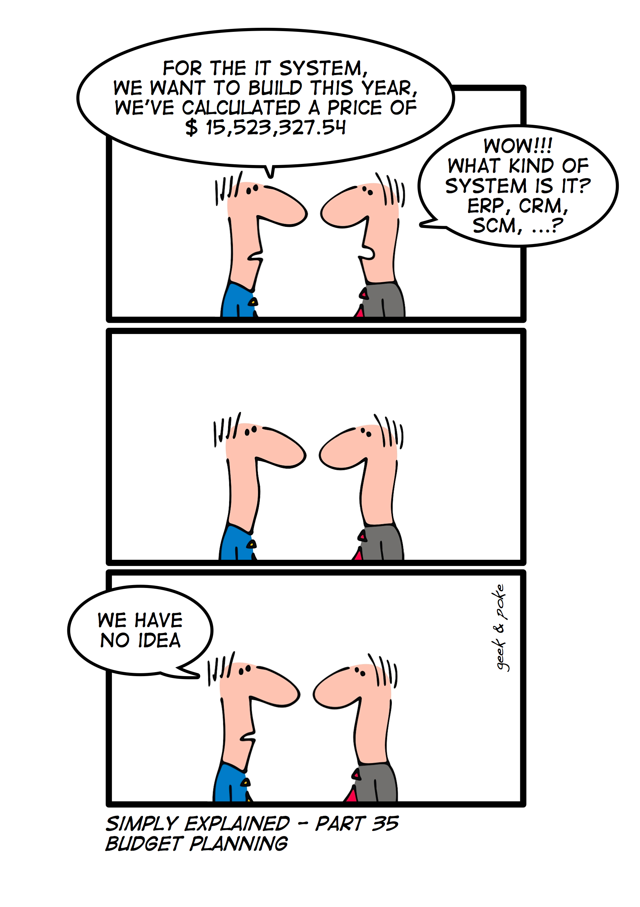
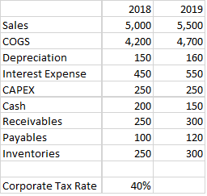
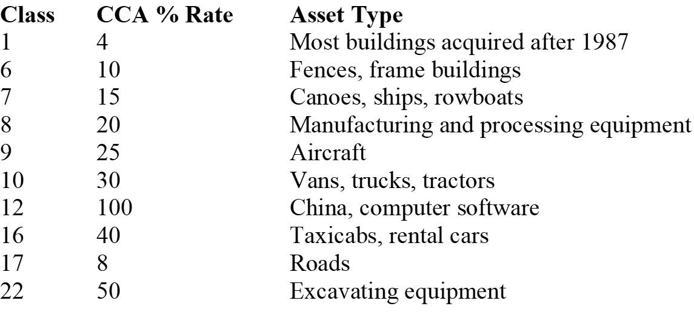

```{css, echo = FALSE}
.remark-slide-content {
  font-size: 18px;
  padding: 20px 80px 20px 80px;
}
.remark-code, .remark-inline-code {
  background: #f0f0f0;
}
.remark-code {
  font-size: 20px;
}
.huge .remark-code { /*Change made here*/
  font-size: 200% !important;
}
.tiny .remark-code { /*Change made here*/
  font-size: 75% !important;
}
```
# How much does an investment cost?

```{r, echo = F, out.width = "35%", fig.align="center"}

```

As satirical as the comic is, the guy was doing a great job as a finance advisor, since he was able to figure out the cost of building the IT system. (Without knowing anything about it!)
---

# Capital Budgeting

.large[
In order to calculate the NPV of a project, firm needs to know:

- Initial investment
  - Cost of machinery
  - Set up costs
  - etc.

- Future revenues and expenses
  - Wage
  - Rent
  - Machinery maintenance
  - etc.
]
---

# Free Cash Flow (FCF)

.large[
Free cash flow (**FCF**) is the net cash inflow from a firm's operation less capital expenditures (CAPEX).
  - FCF takes initial investment, revenue, expenses, etc. i.e. Every cash flow related to a project into account.

The NPV equation of an N-year project (based on FCF):
$$
NPV = \sum_{t=0}^N\frac{FCF_t}{(1+r)^t}
$$
How to calculate **FCF**?
]

---

# Income Statement

.pull-left[.right[
\begin{split}
&\text{Revenues}\\
-&\text{Cost of goods sold (COGS)}\\
-&\text{Other Costs}\\
\hline &\text{EBITDA}\\
-&\text{Depreciation (Dep)}\\
\hline &\text{Earnings before Interests and Taxes (EBIT)}\\
-&\text{Interest Expense}\\
\hline &\text{Earnings before Taxes (EBT)}\\
-&\text{Taxes}\\
\hline &\text{Net Income (NI)}
\end{split}
]]
.pull-right[.left[
\begin{split}
&(1)\\
&(2)\\
&(3)\\
&(4) = (1)-(2)-(3)\\
&(5)\\
&(6) = (4)-(5)\\
&(7)\\
&(8) = (6)-(7)\\
&(9)\\
&(10) = (8)-(9)
\end{split}
]]

<br><br>

EBITDA: Earnings before Interest, Taxes, Depreciation and Amortization.
---

# Problem 1: Interest Expenses

.large[
Since we are interested in the **FCF**, which is the cash flow generated by the project to both equity and debt holders. We should exclude the interest expenses.

Instead of net income (**NI**), we calculate the *unlevered net income*, which is the net income assuming there were no debt.
]
$$
\text{Unlevered NI} = EBIT \times (1-T_C)
$$

Where $T_C$ is the corporate tax rate.

.large[
Another way of calculating unlevered net income is to add back the interest expense (post-tax) to the net income (NI):
]
$$
\text{Unlevered NI} = NI + \text{Interest Expense}\times (1-T_C)
$$
---
# Problem 2: Depreciation

.large[
Since depreciation is not a cash expense (i.e. There is no cash transactions as you write-off the depreciation expense), we need to add it to the unlevered net income. This value is the Operating Cash Flow (**OCF**):
]
$$
OCF = \text{Unlevered NI} + Dep
$$
.large[
On the other hand, we can calculate OCF by taxing on the EBITDA (i.e. assuming no debt and no depreciation). However, depreciation generates a tax shield which is a cash inflow. Summing these two items together is another way of calculating **OCF**:
]
$$
OCF = EBITDA\times(1-T_C) + Dep\times T_C
$$
On the right-hand side of the equation, the first item is the post-tax EBITDA, the second item is the depreciation tax shield.
---

# Problem 3: Capital Expenditure (CAPEX)

.large[
**CAPEX**(Sometimes written as CapEX, CAPX) is a cash outflow of purchasing assets. (e.g. land, machinery, etc.) This cash outflow is not recorded in the income statement.

Therefore, when calculating **FCF**, we need to deduct **CAPEX** from the **OCF**.
]

---

### Problem 4: Change in Net Working Capital ( $\Delta\text{NWC}$ )

.large[
Net working capital is the assets or capital tied up with a specific project:
  - e.g. Cash, inventory, receivables and payables.
]
  
\begin{split}
NWC &= \text{Current Assets} - \text{Current Liabilities}\\
&= \text{Cash} + \text{Inventory} + \text{Receivables} - \text{Payables}
\end{split}

.large[
The change in net working capital is a cash item that is not recorded in the income statement, therefore we need to adjust for it by subtracting it from the OCF.
]

.large[
The change in net working capital ( $\Delta\text{NWC}$ ) is the difference of NWC between year t and t-1:
]

\begin{equation}
\Delta NWC = NWC_{t} - NWC_{t-1}
\end{equation}

---

# Finally, a formula for FCF

$$
FCF = \text{Unlevered NI} + Dep - CAPEX - \Delta NWC
$$

Wait, there is more:

<br><br>

$$
FCF = EBIT \times (1-T_C) + Dep - CAPEX - \Delta NWC
$$
<br><br>

$$
FCF = EBITDA \times (1-T_C) + Dep \times T_C - CAPEX - \Delta NWC
$$
<br><br>

$$
FCF = NI + \text{Interest Expenses} \times (1-T_C) + Dep - CAPEX - \Delta NWC
$$
<br><br>
Use whichever formula that is the most convenient based on the information given.
---

# Exercise: FCF

.large[Find the FCF of year 2019:]

```{r, echo = F, out.width = "50%", fig.align="center"}

```

---

# Solution

$$
NWC_{2018} = 200+250-150+250 =550
$$
<br><br>

$$
NWC_{2019} = 150 + 300 - 120 + 300 = 630
$$

<br><br>

$$
\Delta NWC = 630 - 550 = 80
$$

<br><br>

\begin{split}
FCF &= EBITDA \times (1-T_C) + Dep\times T_C - CAPEX - \Delta NWC\\
&= (\text{Sales - COGS}) \times (1-T_C) + Dep\times T_C - CAPEX - \Delta NWC\\
&= (5500 - 4700) \times (1-0.4) + 160 \times 0.4 - 250 - 80\\
&= 214
\end{split}


---

# Depreciation: Straight-line vs CCA

.large[
How to determine depreciation? two different methods are available.

- Straight-line method
  - The depreciation is a constant value every year, usually a fixed percentage of the original CAPEX value.
  
- Capital Cost Allowance (CCA)
  - Used by the Canada Revenue Agency.
  - Calculated by multiplying the undepreciated capital cost (UCC) and the CCA rate.
]
---

# Straight-line Depreciation: Example

.large[
Smith Industries Ltd. is purchasing a machine for $100,000. It is estimated that the machine has a 5-year life span with a scrap value of $20,000.

1. What is the depreciation every year?
2. What is the depreciation tax shield every year? (assuming a marginal corporate tax rate of 40%)
]

---

# Straight-line Depreciation: Example

.large[
Smith Industries Ltd. is purchasing a machine for $100,000. It is estimated that the machine has a 5-year life span with a scrap value of $20,000.

1. What is the depreciation every year?
2. What is the depreciation tax shield every year? (assuming a marginal corporate tax rate of 40%)

Answers:

1. Depreciation every year is (100,000 - 20,000)/5 = $16,000
2. Depreciation tax shield every year is 16,000 x 40% = $6,400.
]

---

# Straight-line Depreciation and Asset Sales

.large[
When an asset is liquidated, the firm pays taxes on captain gain if the selling price is higher than the book value, or receives tax credit if the selling price is lower.

where book value is the purchase price less the accumulated depreciation.
]

<br><br>

$$
\text{Tax paid (or credits received)} = (\text{Sale Price} - \text{Book Value}) \times T_C
$$

---

# Straight-line Depreciation: Example

.large[
Smith Industries Ltd. is purchasing a machine for $100,000. It is estimated that the machine has a 5-year life span with a scrap value of $20,000.

The machine was sold at $60,000 after 3 years of use. What is the tax associated with this transaction? Assume the marginal corporate tax rate is 40%.

]

---

# Straight-line Depreciation: Example

.large[
Smith Industries Ltd. is purchasing a machine for $100,000. It is estimated that the machine has a 5-year life span with a scrap value of $20,000.

The machine was sold at $60,000 after 3 years of use. What is the tax associated with this transaction? Assume the marginal corporate tax rate is 40%.
]

After 3 years, the book value of the machine is:

$$
100,000 - 16,000 \times 3 = \$52,000
$$

Since the selling price was higher than the book value, capital gain tax needs to be paid:

$$
\text{Capital gain tax paid} = (60,000 - 52,000) \times 40\% = \$3,200
$$

---

# CCA Depreciation

.large[
Capital Cost Allowance (**CCA**) is the method of depreciation used by the Canada Revenue Agency, under the Income Tax Act. 

CCA rules:
]
1. CCA assigns assets to different asset classes.

2. Different asset classes have different CCA rate.

3. Depreciation each year equals to **UCC**(Undepreciated capital cost) multiplied by the CCA rate.

4. On the first year, the UCC is 50% of the initial CAPEXl.

---

# Common CCA Asset Classes

.center[

]

---

# CCA: Example

.large[
Smith Industries Ltd. bought a machine that costs $100,000. This machine has a CCA rate of 10%. Assuming a 40% marginal corporate tax rate, what is the yearly CCA and depreciation tax shields for the next 5 years?
]

---

# CCA: Example

.large[
Smith Industries Ltd. bought a machine that costs $100,000. This machine has a CCA rate of 10%. Assuming a 40% marginal corporate tax rate, what is the yearly CCA and depreciation tax shields for the next 4 years?

<br><br>

CAPEX = $100,000, CCA = 10%, $T_C$ = 40%

]

```{r, echo = F}
table <- data.frame("Year" = 1:4, "UCC" = NA, "CCA" = NA, "Tax Shield" = NA)
table[1,2] <-  "50,000 (= 100,000/2)"
table[1,3] = "5,000 (= 50,000 x 0.1)"
table[1,4] = "2,000 (= 5,000 x 0.4)"
table[2,2] = "95,000 (= 100,000 - 5,000)"
table[2,3] = "9,500 (= 95,000 x 0.1)"
table[2,4] = "3,800 (= 9,500 x 0.4)"
table[3,2] = "85,500 (= 95,000 - 9500)"
table[3,3] = "8,550 (= 85,500 x 0.1)"
table[3,4] = "3,420 (= 8,550 x 0.4"
table[3,4] = "3,420 (= 8,550 x 0.4)"
table[4,2] = "76,950 (= 85,500 - 8,550)"
table[4,3] = "7,695 (= 76,950 x 0.1)"
table[4,4] = "3,078 (= 7,695 x 0.4)"

knitr::kable(table, caption = "CAPEX = 100,000, CAA = 10%, T_C = 40%", format = "markdown")
```

---

# CCA and Asset Sales

.large[
Rules regarding asset sales with CCA:

1. No direct tax on asset sales if sale price is less than original purchase price.

2. UCC of the asset pool is reduced by the sales price.

3. Tax shields are generated as long as UCC remains positive.
]

---

# PV of CCA tax shields

.large[
Based on the CCA rules, we can get the formula for the PV of the CCA tax shield:
]

$$
PVTS_{CCA} = \frac{CAPEX \times d \times T_C}{r+d}\times\frac{(1+\frac{r}{2})}{(1+r)}-\frac{\text{Sales Price}_t\times d\times T_C}{r+d}\times \frac{1}{(1+r)^t}
$$

Where:<br>
CAPEX is the initial purchase price of the asset.<br>
$d$ is the CCA rate.<br>
$r$ is the discount rate.<br>
$T_C$ is the corporate tax rate.<br>
$t$ is the year when the asset is sold.<br>
$\text{Sales Price}_t$ is the sales price of the asset at year t.

.large[The first item is the PV of the tax shield generated by the asset if the asset was never sold. The second item is the tax shield decrease due to selling the asset.]

The derivation for the formula can be found in the appendix of this slide.

---

# CCA: Example 2

.large[
Smith Industries Ltd. is purchasing a fleet of trucks for
$105,000 and will also pay $5,000 acquisition costs. 
The trucks will be part of their class 10 pool of assets
that has a CCA rate of 30%.  They have a useful life of
3 years and a net resale value of $10,000 at that time. 
Cash inflows and outflows are $80,000 and $20,000
per year, respectively. $T_C$ = 40% and r = 14%.  

Should the fleet be purchased?

]

---

# CCA Example 2 Solution

.large[Initial CAPEX:]
$$
FCF_0 = -(105,000 + 5,000) = \$-110,000
$$

<br><br>

.large[Annual operating cash inflow after tax:]
$$
(80,000 - 20,000) \times (1-40\%) = \$36,000
$$

<br><br>

.large[PV of the 3 year annuity income from operating:]
\begin{split}
PV_{\text{Operation}} &= \frac{36,000}{0.14}\times\bigg[1-\frac{1}{(1+0.14)^3}\bigg]\\
&= \$55,719
\end{split}

---

# CCA Example 2 Solution cont'd

.large[PV of tax shields:]
\begin{split}
PVTS_{CCA} &= \frac{CAPEX \times d \times T_C}{r+d}\times\frac{(1+\frac{r}{2})}{(1+r)}-\frac{\text{Sales Price}_t\times d\times T_C}{r+d}\times \frac{1}{(1+r)^t}\\
&= \frac{110,000 \times 0.3 \times 0.4}{0.14 + 0.3}\times\frac{(1+\frac{0.14}{2})}{(1+0.14)}-\frac{10,000\times 0.3\times 0.4}{0.14+0.3}\times \frac{1}{(1+0.14)^3}\\
&= \$ 83,579
\end{split}

<br><br>

.large[PV of asset sales:]
$$
PV_{\text{Salvage value}} = 10,000\times \frac{1}{(1+0.14)^3}=\$6,750
$$

---

# CCA Example 2 Solution cont'd

.large[Finally, NPV of purchasing the fleet:]
$$
NPV = -110,000 + 83,579 + 26,317 + 6,750 = \$6,646
$$

<br><br>

.large[
Since NPV is positive, the fleet should be purchased.
]

---


# Further Considerations

- .large[Spillover effects: Cannibalism vs Synergy]
  - What effect does the project has on the sales of existing products?
  
- .large[Opportunity Costs]

  - Take into account the opportunity costs of alternative usage of assets such as land, building and machinery.
  
- .large[Recovery of working capital]

  - At the end of a project, the net working capital are said to be *recovered*, leaving a final NWC of 0.
  
- .large[Sunk costs]

  - Expenses or costs that have already been spent are sunk costs, do **NOT** consider them as cash outflows.
  
---

# In Summary

.large[
We learned:

- Learned how to compute NPV of a project based on free cash flow (FCF).

- How to compute FCF for every year based on accounting information.

- How to calculate depreciation and tax shields with:
  - Straight-line method
  - CCA method

- How to calculate the PV of a CCA tax shield.
]

You are now ready for the first case of the course!

---

# Formula Sheet

$$
NPV = \sum_{t=0}^N\frac{FCF_t}{(1+r)^t}
$$

<br><br>

.large[Yearly FCF calculation:]

$$
FCF = \text{Unlevered NI} + Dep - CAPEX - \Delta NWC
$$

$$
FCF = EBIT \times (1-T_C) + Dep - CAPEX - \Delta NWC
$$

$$
FCF = EBITDA \times (1-T_C) + Dep \times T_C - CAPEX - \Delta NWC
$$

$$
FCF = NI + \text{Interest Expenses} \times (1-T_C) + Dep - CAPEX - \Delta NWC
$$
---
# Formula Sheet cont'd

.large[Straight-line depreciation asset sales:]
$$
\text{Tax paid (or credits received)} = (\text{Sale Price} - \text{Book Value}) \times T_C
$$

<br><br>

.large[PV of CCA tax shields:]
$$
PVTS_{CCA} = \frac{CAPEX \times d \times T_C}{r+d}\times\frac{(1+\frac{r}{2})}{(1+r)}-\frac{\text{Sales Price}_t\times d\times T_C}{r+d}\times \frac{1}{(1+r)^t}
$$
---

# Appendix

### CCA tax shield formula derivation

.large[**NOT** required for exam.]

Consider separating the asset value to two equal parts:
- First half will depreciate starting from year 1
- Second half wil depreciate starting from year 2

The depreciation tax shields generated from each half is then a (negatively) growing perpetuity with growth rate of (-d), and discount rate of r, and the value of the first cash flow is $CAPEX/2 \times d \times T_C$. Therefore,

$$
PV(\text{Asset first half}) = \frac{CAPEX/2 \times d \times T_C}{r-(-d)}
$$

$$
PV(\text{Asset second half}) = \frac{CAPEX/2 \times d \times T_C}{r-(-d)}\times \frac{1}{1+r}
$$

---

# Appendix

### CCA tax shield formula derivation cont'd

The reduction of tax shield due to salvage value is also a (negatively) growing perpetuity starting from year $t+1$. With the value of the first cash flow being $\text{Sales Price}_t \times d\times T_C$. Therefore,

$$
PV(\text{Salvage value tax shield decrease}) = \frac{\text{Sales Price}_t \times d\times T_C}{r-(-d)}\times\frac{1}{(1+r)^t}
$$

Sum up the first two items and minus the last item, we get the full equation:

$$
PVTS_{CCA} = \frac{CAPEX \times d \times T_C}{r+d}\times\frac{(1+\frac{r}{2})}{(1+r)}-\frac{\text{Sales Price}_t\times d\times T_C}{r+d}\times \frac{1}{(1+r)^t}
$$